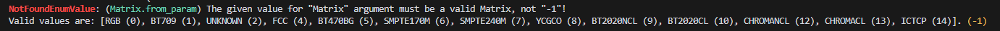

# Common Errors

!!! warning "This section is incomplete!"

    This section is a stub.
    You can help us
    by [expanding it](https://github.com/Jaded-Encoding-Thaumaturgy/JET-guide?tab=readme-ov-file#contributing).

Below is a list of common errors,
their (presumed) causes,
and how to resolve them.

!!! Warning

    This page may prove useful for simple troubleshooting,
    but if your error is not on here
    or the given solution doesn't resolve it,
    you may be able to find a better solution by Googling
    or by posting your [stack trace or traceback][traceback]
    in the JET Discord server.

<!--
Contributors: When adding new errors to this list, please follow these guidelines:

1. Keep the error message in the first column as close to the original as possible. Replace names with [name], [package], [plugin], etc.
2. Provide a clear, concise explanation in the "Meaning" column.
3. If applicable, include a brief suggestion for resolving the error.
-->

## Generic Errors

Errors that are relatively generic and can occur with any script or package.

| Error                                                                                                                           | Meaning                                                                                                                                                                                                                         |
| ------------------------------------------------------------------------------------------------------------------------------- | ------------------------------------------------------------------------------------------------------------------------------------------------------------------------------------------------------------------------------- |
| AttributeError: No attribute with the name '[plugin]' exists. Did you mistype a plugin namespace or forget to install a plugin? | The specified Vapoursynth plugin doesn't exist. Check for typos and/or ensure the required plugin is installed.                                                                                                                 |
| ModuleNotFoundError: No module named '[package]'                                                                                | The specified Python package doesn't exist. Check for typos and/or ensure the required package is installed.                                                                                                                    |
| ImportError: cannot import name '[name]' from '[package]'                                                                       | The specified functions, class, or variables cannot be imported from the given package. Check for typos and/or ensure the required packages is installed, or that the thing you're trying to import has been properly exported. |
| ERROR: pip's dependency resolver does not currently take into account all the packages that are installed.                      | Warning that indicate pip might not be considering all installed packages when resolving dependencies. This is usually not a critical error, but is indicative of conflicts or inconsistencies in package versions.             |

## Filter-specific Errors

Common errors users run into with some specific filters.

| Error                                                                                                                 | Meaning                                                                                                                                                                                                        |
| --------------------------------------------------------------------------------------------------------------------- | -------------------------------------------------------------------------------------------------------------------------------------------------------------------------------------------------------------- |
| vapoursynth.Error: Expr: All inputs must have the same number of planes and the same dimensions, subsampling included | The given clips have a different combination of dimensions/resolutions and/or subsampling. Thrown in `std.Expr`. This can be fixed by resampling all the inputs to the same dimensions and subsampling format. |
| vapoursynth.Error: lsmas: failed to open file.                                                                        | The given file could not be found. Check for typos and/or ensure the file exists in the provided location.                                                                                                     |

## JET-specific Errors

Special errors raised by JET and its custom exceptions.
JET errors are commonly formatted like this:

!!! example

    ```txt
        NameOfSomeTypeOfError: (Name of the function/method this originated from) Message explaining the error and possibly solutions (An optional more specific reason the error was thrown, such as an invalid value)
    ```

For example, the following code will throw this error:

!!! example

    ```py
      from vstools import Matrix

      Matrix.from_param(-1)

    ```

    ```txt
       NotFoundEnumValueError: (Matrix().from_param) The given value for "<enum 'Matrix'>" argument must be a valid Matrix, not "-1"!
       Valid values are: [RGB (0), BT709 (1), UNSPECIFIED (2), FCC (4), BT470_BG (5), ST170_M (6), ST240_M (7), YCGCO (8), BT2020_NCL (9), BT2020_CL (10), CHROMATICITY_DERIVED_NC (12), CHROMATICITY_DERIVED_CL (13), ICTCP (14)]. (-1)
    ```

    

| Error                                        | Meaning                                                                                                    |
| -------------------------------------------- | ---------------------------------------------------------------------------------------------------------- |
| FileNotExistsError: (source) [PATH/TO/VIDEO] | The given file could not be found. Check for typos and/or ensure the file exists in the provided location. |

[traceback]: https://realpython.com/python-traceback/
