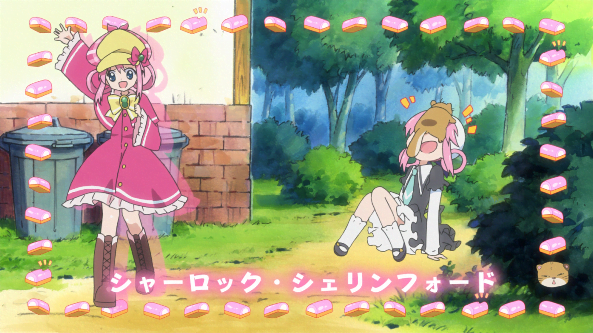
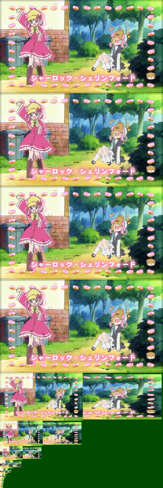
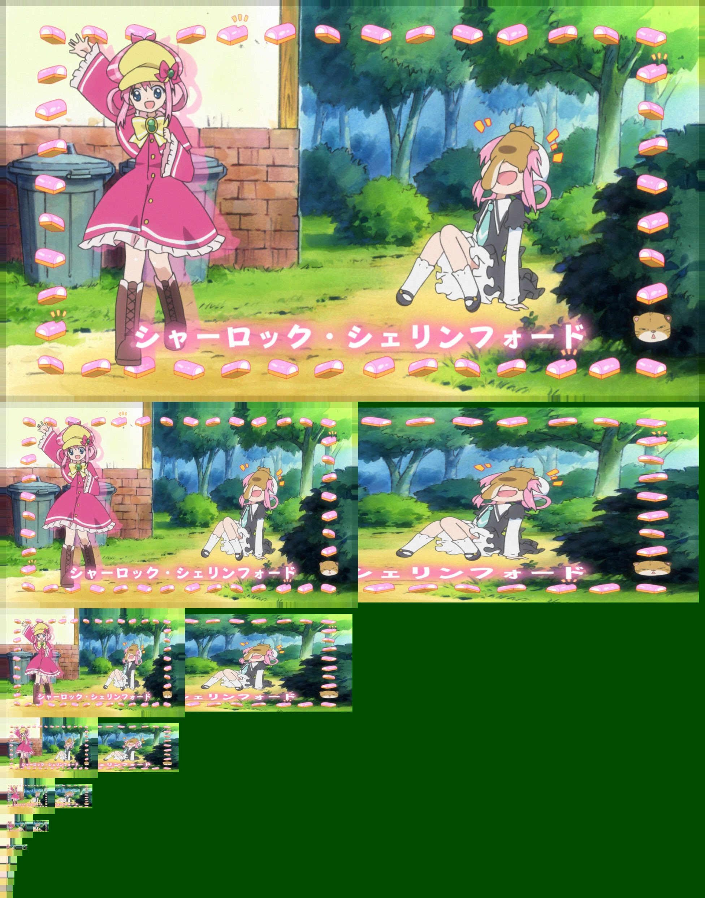
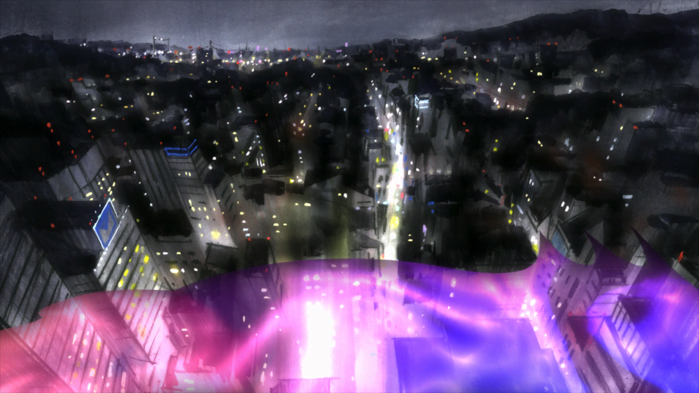

# Motion Vector Tools

!!! warning "This page is incomplete!"

    This list is a stub
    and still very incomplete!
    You can help us
    by [expanding it](https://github.com/Jaded-Encoding-Thaumaturgy/JET-guide?tab=readme-ov-file#contributing).

    ??? question "How can I help?"

        - Show different examples of sources and MVTools application

Motion Vector Tools, or MVTools, is a cornerstone
of many video processing tools.
It works by analyzing the motion between concurrent frames,
and return motion vectors that can be leveraged for many purposes.

## MVTools Class and Methods

Vapoursynth's MVTools can be imported from the `vsdenoise` Python library.

```python
from vsdenoise import MVTools

mv = MVTools(clip)
```

This class accepts a number of arguments:

- `clip`

The clip to process.
This is the clip that methods that make use of the analyze results
will operate on, such as `degrain`.

- `search_clip`

The clip to use for motion vector search.
By default, this will be the same as `clip`.
If specified, this clip will be used for motion estimation
while keeping the original clip for compensation.

If your source is very noisy or otherwise difficult to analyze,
you can prefilter it and pass the prefiltered clip to `search_clip`
to improve the quality of the motion estimation.
Common examples include pre-denoising
using a spatial filter such as `vsdenoise.DFTTest`,
or increasing the levels of the clip using `vsdenoise.prefilter_to_full_range`.

- `vectors`

Pre-calculated motion vectors to use.
If None (default), the class will calculate its own vectors.

- `pad`

How much padding to add to the source frame.
Small padding is added to help with motion estimation near frame borders.

- `pel`

Subpixel precision for motion estimation.
1 means pixel precision, 2 means half-pixel, 4 means quarter-pixel.
Higher precision can give better results but increases processing time.
Default is 1.

- `planes`

Which planes to process.
Default is None (all planes).

- Various `*_args` parameters

Arguments that will be passed to their respective MVTools functions.
Args are accepted here so MVTools presets can be used.

- `super_args`: Arguments for the `super` function
- `analyze_args`: Arguments for the `analyze` function
- `recalculate_args`: Arguments for the `recalculate` function
- `compensate_args`: Arguments for the `compensate` function
- `degrain_args`: Arguments for the `degrain` function

!!! example "Reference clip"

    

### super

!!! info "Required method"

    This method is required for all other methods to work,
    and must always be called.

```python
mv.super()
```

Creates a clip suitable for motion vector analysis.
This is done by creating a pyramid of frames at different scales,
The resulting clip contains the original frames
along with additional data used by subsequent MVTools functions.
This clip should not be adjusted by the user.

??? example "Super clip"

    === "Default parameters"

        ```python
        mv = MVTools(src)

        mv.super()
        ```

        

    === "With pel=2"

        ```python
        mv = MVTools(src, pel=2)

        mv.super()
        ```

        Notice how there's fewer "big" frames.

        

### analyze

!!! info "Required method"

    This method is required for all other methods to work,
    and must always be called.

```python
mv.analyze()
```

Analyzes motion between frames to generate motion vectors.
This function estimates how objects and details move
between consecutive frames in the video
based on block matching frames
using the `super` clip.

Analyze is performed using
a Sum of Absolute Differences (SAD) prediction,
which compares blocks between frames
by adding up the absolute differences
between corresponding pixels.

### recalculate

!!! warning "This section is incomplete!"
    This section is a stub.
    You can help us
    by [expanding it](https://github.com/Jaded-Encoding-Thaumaturgy/JET-guide?tab=readme-ov-file#contributing).

    ??? question "How can I help?"

        - Explain why recalculate is useful
        - Show examples where recalculate proves an easily-visible improvement

```python
mv.recalculate()
```

Refines existing motion vectors for improved accuracy.
This function performs additional analysis
to reduce errors and improve the quality of motion estimation.

### compensate

```python
mv.compensate()
```

Uses motion vectors to create motion-compensated frames.
This function shifts pixels according to the calculated motion,
which helps align details between frames
for temporal processing operations.

!!! warning "Overlap"

    The `compensate` method requires you
    to have set `blksize` and `overlap`
    in the `analyze` method,
    as well as `recalculate`
    if that method was called.

??? example "Compensate clip"

    ```python
    mv = MVTools(src)

    mv.super()
    mv.analyze(blksize=(32, 32), overlap=(16, 16))
    mv.recalculate(blksize=(32, 32), overlap=(16, 16))

    compensated_clip, frame_offsets = mv.compensate()
    ```

    === "Original frame"

        

    === "Compensated Frame A"

        

    === "Compensated Frame B"

        

    === "Compensated Frame C"

        

This method returns a tuple containing:

- `compensated_clip`: The interleaved motion-compensated frames
- `frame_offsets`: A tuple containing:
    - `total_frames`: Total number of frames in the compensated clip
    - `center_offset`: Frame offset to the center frame

This method is mostly useful for very simple motion interpolation,
or to be used as a reference for more advanced motion interpolation functions
(such as for example `QTempGaussMC`).


### degrain

```python
mv.degrain()
```

Performs temporal denoising using motion compensation.
This function combines information from multiple frames
while accounting for motion to reduce noise
while preserving moving details.

This method is a rather simple denoising method,
and is not recommended to be used alone.
It is mostly useful as a reference for more advanced denoising methods,
such as through `BM3D`.

!!! example "Degrained clip"

    [Comparison of MVTools degrain with different thsad values.](https://slow.pics/c/Z4M9eCfv)

    === "Original frame"

        

    === "Degrained frame (thsad=100)"

        

    === "Degrained frame (thsad=250)"

        

    === "Degrained frame (thsad=500)"

        

## Motion Interpolation

!!! warning "This section is incomplete!"
    This section is a stub.
    You can help us
    by [expanding it](https://github.com/Jaded-Encoding-Thaumaturgy/JET-guide?tab=readme-ov-file#contributing).

    ??? question "How can I help?"

        - Write about motion interpolation
        - Write about use-cases to improve interpolation using MVTools-compensated clip

## Denoising

The most common use of MVTools is for temporal denoising.
By analyzing motion between frames,
MVTools can track how objects and details move over time.
This information allows us to distinguish
between consistent details that follow expected motion patterns,
and random noise that appears independently between frames.
This allows us to apply more aggressive noise reduction
while reducing the risk of introducing ghosting or smearing.

!!! warning "Static noise"

    MVTools can only effectively reduce noise that changes between frames.
    If noise patterns remain static across multiple frames,
    MVTools will treat them as legitimate image detail
    since they don't exhibit any motion.
    This means static noise, including some types of dithering and grain,
    will be preserved rather than removed.
    This limitation can be circumvented
    by combining MVTools with spatial filtering.

Denoising with MVTools is done through two steps:

1. Motion Estimation

First, we need to create a motion vector search clip.
This is a clip that contains the original frames,
and the frames that have been shifted by the motion vectors.
This is done by using the `super` method,
which creates a new clip with the original frames,
and the frames that have been shifted by the motion vectors.

```python
from vsdenoise import MVTools

# Create MVTools object for motion estimation
mv = MVTools(clip)

# Create motion vector search clip
mv.super()

# Analyze motion vectors between frames
mv.analyze()

# Refine motion vectors for increased accuracy
mv.recalculate()
```

2. Denoising

Denoising can be performed using the `degrain` method.

```python
mv.degrain()
```

However, it's not recommended to use this method alone.
Instead, it's recommended to use this as a reference clip
for more complex denoising functions,
such as `BM3D`.

??? example "Using MVTools as a basic clip for BM3D"

    ```python
    pre_mv = MVTools(pref)

    pre_mv.super()
    pre_mv.analyze()
    pre_mv.recalculate()

    pre_mv_final = pre_mv.degrain(thsad=(100, 50))

    den = BM3D.denoise(clip, sigma=1, ref=pre_mv_final, planes=0)
    ```

When degraining using MVTools,
try to lower the `thsad` value as much as possible.
Higher values will create more smearing and ghosting.
