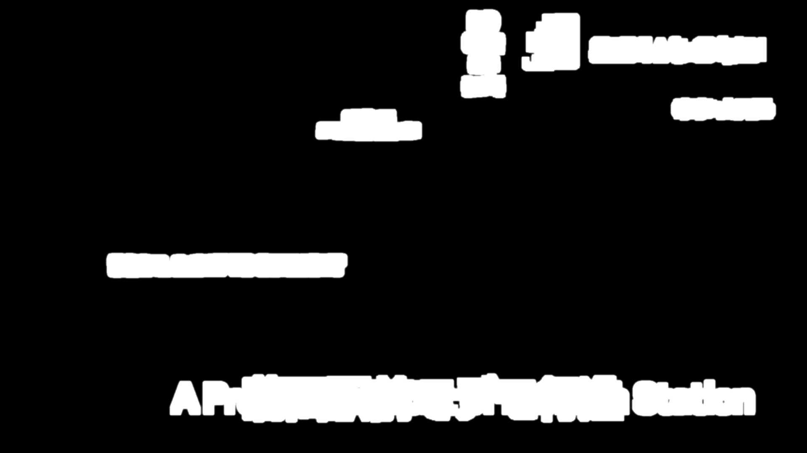
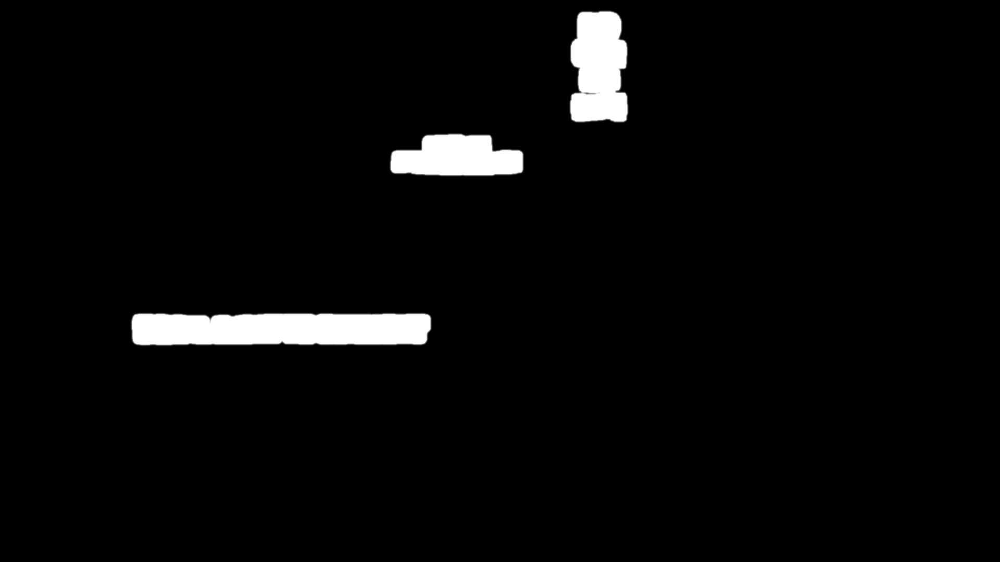
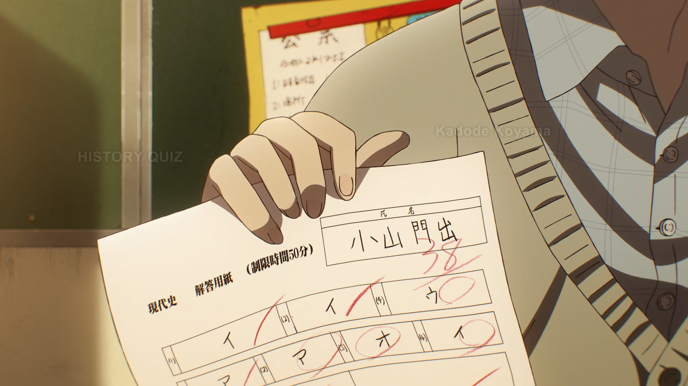
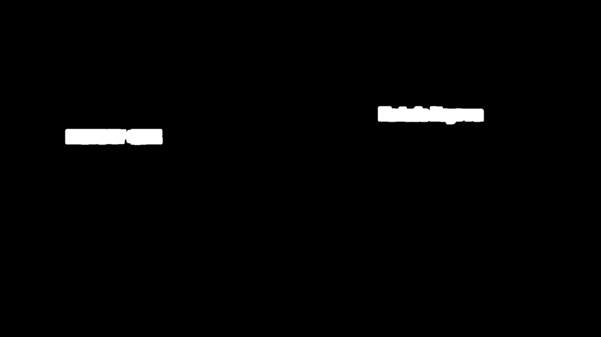

# Dehardsubbing

Hardsubs are subtitles that are a part of the video, i.e. they are "burned-in."
This is in contrast to softsubs which are kept separate from the video and thus
can be toggled or edited without requiring a new encode.

This page will go over how to dehardsub (remove hardsubs) from a video.

## Prerequisite

Dehardsubbing requires a secondary video source that is **not** hardsubbed in
order to fill in the details that the hardsubs of the primary video source
replaced. The secondary source is called the "reference" or "ref" clip in the
[vs-masktools][] APIs that will be shown here.

_DEAD DEAD DEMONS DEDEDEDE DESTRUCTION_ (2024) will be used as a contemporary
example of this. The WEB release of this movie/ONA has two video sources: the
<abbr title="Crunchyroll">CR</abbr> Japanese stream with no (English) hardsubs,
and the <abbr title="Crunchyroll">CR</abbr> English stream with hardsubs.

## Getting Started

Here is an example of a hardsub that one might want to dehardsub, because it
doesn't look particularly good and a typesetter could redo it via softsubs:

=== "Hardsubbed"
    

=== "Reference"
    

Since a video without hardsubs (the reference clip here) is available, one
solution is to simply replace this hardsubbed scene with its counterpart:

```py
from vstools import replace_ranges

dehardsub = replace_ranges(hardsub, ref, (1138, 1221))
```

This will replace frames 1138 through 1221 (inclusive) of the hardsubbed clip
`hardsub` with the reference clip `ref`. This is a fine solution if both sources
are of equal quality and nothing of value is being lost by throwing away this
whole range of frames from `hardsub`.

But let's say that `hardsub` is a better video source than `ref`, or that these
sources are being Lehmer-merged, or that for any other reason it is undesirable
to replace whole frames like this if it can be avoided. A better solution then
would be to replace only the hardsubbed region of the scene. This can be
accomplished with classes like `HardsubSign`:

```py
from vsmasktools import HardsubSign

dehardsub = HardsubSign(ranges=[(1138, 1221)]).apply_dehardsub(hardsub, ref)

# Can optionally get the mask to preview or modify it.
dehardsub_mask = HardsubSign(ranges=[(1138, 1221)]).get_mask(hardsub, ref)
```

This will find the differences between the `hardsub` and `ref` clips, for the
same frame range as before, and apply a mask that replaces just the hardsubbed
region of `hardsub` with the respective region from `ref`.

=== "Hardsubbed"
    

=== "Hardsub mask"
    

## Bounding

This next example demonstrates two kinds of hardsubs: the good and the bad.
Here, the news broadcast's overlay is actually good (for an English release, at
least) and leaving it hardsubbed would save a typesetter some time. However,
this scene also has the bad Arial signs that could be redone better in softsubs
if they're important. If one tries to use `HardsubSign` like before on this, it
will mask everything.

=== "Hardsubbed"
    

=== "Reference"
    

=== "Hardsub mask"
    

Since the bad hardsubs are all contained to a single region for the whole scene,
the mask can be bounded by a `BoundingBox`. Think of this as masking the mask.

```py
from vsmasktools import BoundingBox, HardsubSign

dehardsub = HardsubSign(
    ranges=[(13784, 13843)],
    bound=BoundingBox(pos=(0, 0), size=(1230, 880))
).apply_dehardsub(hardsub, ref)
```

The bound is drawn from coordinate (0, 0) (the top-left corner) to a size of
1230x880, which is enough to cover only the Arial signs.

=== "Hardsubbed"
    

=== "Hardsub mask"
    

=== "Bounded hardsub mask"
    

=== "Dehardsubbed"
    

## Fades

Hardsubs that fade in or out may require special handling to account for when
the hardsub is at its peak transparency. Lowering the threshold parameter `thr`
of `HardsubSign` may help but this can also begin to catch differences in noise
between the clips. This example will use `HardsubSignFades`, a specialized
version of `HardsubSign`, on the first frame of a fade-in since that is the most
difficult part of the sequence to mask.

```py
from vsmasktools import HardsubSignFades
from vstools import get_y, replace_ranges

dehardsub_mask = HardsubSignFades().get_mask(hardsub, ref)
dehardsub = hardsub.std.MaskedMerge(ref, get_y(dehardsub_mask))
dehardsub = replace_ranges(hardsub, dehardsub, (1462, 1524))
```

=== "Hardsubbed"
    

=== "Reference"
    

=== "Hardsub mask"
    

=== "Hardsub fade mask"
    

Notice how just with default parameters, `HardsubSignFades` is able to catch
more of the hardsubs than plain `HardsubSign` can. This snippet also
demonstrates how it is not necessary to use the `apply_dehardsub()` function;
instead one can call `get_mask()` to get the dehardsub mask for any further
processing before applying it themselves. Don't forget to `replace_ranges()`
just the hardsubbed range(s) afterwards, since that was previously being handled
by `apply_dehardsub()`.

## Combining

When there are multiple hardsubs across the whole clip, there are a few
convenient ways of applying all the masks without needing to duplicate the above
snippets for each hardsub.

The first method is to take advantage of the `ranges` parameter, so long as all
of the respective hardsubs can be handled in the same way.

```py
from vsmasktools import HardsubSign

# Frame ranges (inclusive) that contain hardsubs.
HARDSUBS = [
    (1138, 1221),
    (11045, 11143),
    (14079, 14173),
    # etc.
]

dehardsub = HardsubSign(ranges=HARDSUBS).apply_dehardsub(hardsub, ref)
```

The remaining two methods are more flexible in that they allow for combining
different types of `HardsubSign`. In this example there are regular hardsubs and
fading hardsubs:

```py
from vsmasktools import HardsubSign, HardsubSignFades

# Frame ranges (inclusive) that contain regular hardsubs.
HARDSUBS = [
    (1138, 1221),
    (11045, 11143),
    (14079, 14173),
    # etc.
]

# Frame ranges (inclusive) that contain fading hardsubs.
HARDSUB_FADES = [
    (1462, 1524),
    (9459, 9511),
    # etc.
]

regular_dehardsub = HardsubSign(ranges=HARDSUBS)
fading_dehardsub = HardsubSignFades(ranges=HARDSUB_FADES)
```

From here, one can either use `get_all_sign_masks()` to get a composite mask
containing everything:

```py
from vsmasktools import get_all_sign_masks

dehardsub_mask = get_all_sign_masks(hardsub, ref, [regular_dehardsub, fading_dehardsub])
dehardsub = hardsub.std.MaskedMerge(ref, dehardsub_mask)
```

Or sequentially apply each mask with `bounded_dehardsub()`:

```py
from vsmasktools import bounded_dehardsub

dehardsub = bounded_dehardsub(hardsub, ref, [regular_dehardsub, fading_dehardsub])
```

[vs-masktools]: https://github.com/Jaded-Encoding-Thaumaturgy/vs-masktools
