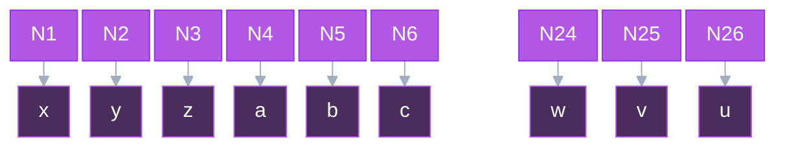
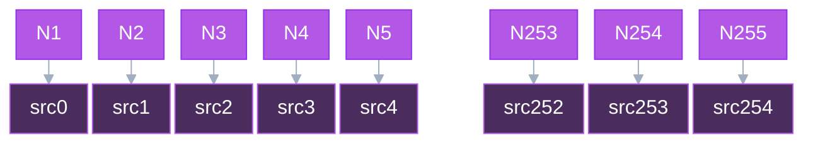

# Vapoursynth Expressions

Vapoursynth expressions (expr)
are a powerful feature
that allows you to perform per-pixel operations
using a simple expression syntax.
Common use cases for expressions include:

- Arithmetic operations on pixel values
  (addition, subtraction, multiplication, etc.)
- Combining multiple clips
  through mathematical operations
- Creating masks
  based on pixel values
  or clip differences
- Simple color adjustments
  and corrections
- Implementing basic
  pixel-based filters

Expressions are much more powerful
than this,
and can be used
for even more complex operations,
such as:

- Complex color space conversions
  and transformations
- Creating adaptive masks
  based on multiple conditions
- Noise detection
  and filtering
- Edge detection
  and enhancement
- Complex mathematical operations
  for specialized filters
- Frame property storing
  and comparison using single pixel clips

There are two
different implementations
of expressions in Vapoursynth:

1. The standard `std.Expr` function from the core library
2. The optimized `akarin.Expr` function from the [`akarin` plugin](https://github.com/AkarinVS/vapoursynth-plugin#expr)

Both implementations provide the same core functionality,
but `akarin.Expr` is an optimized extension
that offers enhanced performance and additional features
through a slightly modified syntax.

This guide will use the `akarin.Expr` implementation
as it is more powerful
and covers all the use-cases
the standard library does
and more.

## Postfix and Infix Notation

!!! info "Reverse Polish Notation"

    Postfix notation is also known as
    [Reverse Polish Notation](https://en.wikipedia.org/wiki/Reverse_Polish_notation) (RPN),
    and that's what a lot of documentation
    and encoders use
    when speaking on the topic.

### Basic Syntax

If you've studied any algebra,
you've probably seen expressions
written in infix notation,
where the operator is placed between the operands:
$$
x * 1.5 - 10
$$
Infix notation is easy to understand for humans,
but it can be more difficult for machines to parse.
That's why expressions in Vapoursynth use postfix notation,
where the operator is placed after the operands:
$$
x\ 1.5\ *\ 10\ -
$$
This can be a bit confusing at first,
but it's actually quite simple once you get the hang of it.

### Stack Evaluation

Postfix notation works by using a _stack_,
a data structure
where values are pushed on top
and popped off from the top.
We can see how this works
with a simple example:
$$
5\ 10\ 3\ -\ *
$$
The expression is evaluated from left to right:

1. When we see a number,
      we push it onto the stack:

      1. Push $5$: Stack is $[5]$
      2. Push $10$: Stack is $[5, 10]$
      3. Push $3$: Stack is $[5, 10, 3]$

2. When we see an operator,
      we pop the required number of values
      off the stack,
      apply the operator,
      and push the result back.

      - See `-`:

        1. Pop $3$, then $10$ from the stack
        2. Calculate $10 - 3$
        3. Push $7$: Stack is $[5, 7]$

      - See `*`:
        1. Pop $7$, then $5$ from the stack
        2. Calculate $5 * 7$
        3. Push $35$: Stack is $[35]$

The final value on the stack ($35$)
is our result.

```mermaid
%%{
  init: {
    'theme': 'base',
    'themeVariables': {
      'primaryColor': '#b257e6',
      'primaryTextColor': '#ffffff',
      'primaryBorderColor': '#9333ea',
      'lineColor': '#a0aec0',
      'secondaryColor': '#2d3748',
      'tertiaryColor': '#4a2d5d'
    },
    'flowchart': {
      'curve': 'basis',
      'padding': 10,
      'rankSpacing': 30,
    }
  }
}%%

graph TD
    classDef default fill:#2d3748,stroke:#4a5568,stroke-width:1px;
    classDef operation fill:#b257e6,stroke:#9333ea,color:#ffffff,stroke-width:2px;
    classDef stack fill:#4a2d5d,stroke:#b257e6,color:#ffffff,stroke-width:2px;

    subgraph "Stack Operations"
        A["Initial Stack"]:::operation
        B["Push (5)"]:::operation
        C["Push (10)"]:::operation
        D["Push (3)"]:::operation
        E["Subtract (10 - 3)"]:::operation
        F["Multiply (5 * 7)"]:::operation
    end

    subgraph "Expression: 5 10 3 - *"
        G["Stack: []"]:::stack
        H["Stack: [5]"]:::stack
        I["Stack: [5, 10]"]:::stack
        J["Stack: [5, 10, 3]"]:::stack
        K["Stack: [5, 7]"]:::stack
        L["Stack: [35]"]:::stack
    end

    A --> B
    B --> C
    C --> D
    D --> E
    E --> F

    G --> H
    H --> I
    I --> J
    J --> K
    K --> L

    B -.-> H
    C -.-> I
    D -.-> J
    E -.-> K
    F -.-> L
```



??? question "Why is postfix notation preferred?"

    Postfix notation is easier for machines to parse
    because of how expression trees are evaluated.
    Expression trees are evaluated bottom-up,
    where child nodes must be calculated
    before parent nodes
    and values flow upward to operators.
    With infix notation,
    when reaching an operator,
    only the left subtree is complete,
    so the machine must store state
    and backtrack for the right subtree.
    However, with postfix notation,
    all required values are already calculated,
    allowing immediate evaluation
    with only a single stack
    as state.

### Reading Postfix Expressions

If you have trouble reading
a postfix expression,
JET has a [simple website](https://jaded-encoding-thaumaturgy.github.io/expr101/)
where you can enter an expression
and hover over operators
to show which values
on the stack are being operated on.
Using our previous expression:
$$
5\ 10\ 3\ -\ *
$$
Hovering over the `*`
and `-` operators
shows affected values:

<br>


<!-- TODO: Improve upon this section -->

## Plugin Syntax

To use expressions in a script,
you can use the `akarin.Expr` plugin.
The `std.Expr` function
can also be used,
but it has fewer features.

### Clips

The plugins accept a list of `VideoNode`s,
and will apply the expression to each pixel
of the first given clip.
Note that the plugins
always return a single `VideoNode`
that is the result of applying the expression
to the first input clip,
regardless of how many input clips are provided.

In standard Vapoursynth expressions,
each `VideoNode`
is represented by a single character.
This starts from $x$ and goes through the alphabet up to $u$.



`akarin.Expr` extends the standard Vapoursynth expression syntax
by adding an additional operator
that makes these values more human-readable,
while also allowing you to pass
a theoretically arbitrary number
of clips.
This operator is `srcN`,
where `N` is the index value.



### Expressions

Expressions are the core of these plugins.
It makes use of operators
to manipulate pixel values.
Below is a list of operators,
small descriptions
on what they do,
which plugins support which,
and how many values
they take from the stack.

??? info "Operator table"

    | Operator       | Description                                       | `std.Expr` | `akarin.Expr` | Values |
    | -------------- | ------------------------------------------------- | ---------- | ------------- | ------ |
    | `+`            | Addition                                          | ✅         | ✅            | 2      |
    | `-`            | Subtraction                                       | ✅         | ✅            | 2      |
    | `*`            | Multiplication                                    | ✅         | ✅            | 2      |
    | `/`            | Division                                          | ✅         | ✅            | 2      |
    | `%`            | Modulo                                            | ❌         | ✅            | 2      |
    | `<`            | Less than                                         | ✅         | ✅            | 2      |
    | `>`            | Greater than                                      | ✅         | ✅            | 2      |
    | `=`            | Equal to                                          | ✅         | ✅            | 2      |
    | `>=`           | Greater than or equal                             | ✅         | ✅            | 2      |
    | `<=`           | Less than or equal                                | ✅         | ✅            | 2      |
    | `and`          | Logical AND                                       | ✅         | ✅            | 2      |
    | `or`           | Logical OR                                        | ✅         | ✅            | 2      |
    | `xor`          | Logical XOR                                       | ✅         | ✅            | 2      |
    | `not`          | Logical NOT                                       | ✅         | ✅            | 1      |
    | `exp`          | Exponential                                       | ✅         | ✅            | 1      |
    | `log`          | Natural logarithm                                 | ✅         | ✅            | 1      |
    | `sqrt`         | Square root                                       | ✅         | ✅            | 1      |
    | `pow`          | Power                                             | ✅         | ✅            | 2      |
    | `abs`          | Absolute value                                    | ✅         | ✅            | 1      |
    | `sin`          | Sine                                              | ✅         | ✅            | 1      |
    | `cos`          | Cosine                                            | ✅         | ✅            | 1      |
    | `min`          | Minimum                                           | ✅         | ✅            | 2      |
    | `max`          | Maximum                                           | ✅         | ✅            | 2      |
    | `floor`        | Round down                                        | ❌         | ✅            | 1      |
    | `ceil`         | Round up                                          | ❌         | ✅            | 1      |
    | `round`        | Round to nearest                                  | ❌         | ✅            | 1      |
    | `trunc`        | Truncate decimal                                  | ❌         | ✅            | 1      |
    | `clamp`/`clip` | Clamp values to custom range (i.e. limited range) | ❌         | ✅            | 3      |
    | `?`            | Ternary operator                                  | ✅         | ✅            | 3      |
    | `dup`          | Duplicate top stack value                         | ✅         | ✅            | 1      |
    | `swap`         | Swap top two stack values                         | ✅         | ✅            | 2      |
    | `x[r,r]`       | Static relative pixel access                      | ❌         | ✅            | 0      |
    | `x[]`          | Dynamic absolute pixel access                     | ❌         | ✅            | 2      |
    | `srcN`         | [Access Nth input clip (N≥0)](#clips)             | ❌         | ✅            | 0      |
    | `N`            | Current frame number                              | ❌         | ✅            | 0      |
    | `X`            | Current column position                           | ❌         | ✅            | 0      |
    | `Y`            | Current row position                              | ❌         | ✅            | 0      |
    | `width`        | Frame width                                       | ❌         | ✅            | 0      |
    | `height`       | Frame height                                      | ❌         | ✅            | 0      |
    | `var!`         | Store to variable                                 | ❌         | ✅            | 1      |
    | `var@`         | Read from variable                                | ❌         | ✅            | 0      |
    | `dropN`        | Drop N items from stack                           | ❌         | ✅            | N      |
    | `sortN`        | Sort top N items on stack                         | ❌         | ✅            | N      |
    | `0x123`        | Hexadecimal constants                             | ❌         | ✅            | 0      |
    | `023`          | Octal constants                                   | ❌         | ✅            | 0      |

Both expression plugins
accept either a single string
or a list of strings
as the expression argument.
When passing a list,
the number of expressions can match
the number of planes in the first clip.
For example,
a YUV clip would accept up to 3 expressions:
one for the Y plane,
one for the U plane,
and one for the V plane.

If fewer expressions are provided
than planes,
the last expression in the list
will be used for any remaining planes.
When passing just a single expression string,
that expression will be applied to all planes.

```py
clip = akarin.Expr([clip1, clip2], "x 1 +")
```

This will apply the expression `x 1 +`
to every plane of the first input clip.
This is equivalent to the following:

```py
clip = akarin.Expr([clip1, clip2], ["x 1 +", "x 1 +", "x 1 +"])
```

If we want to only apply an expression
to a single plane,
we can pass empty strings.
For example,
if we only want to apply an expression
to the U plane,
we can pass the following:

```py
clip = akarin.Expr([clip1, clip2], ["", "x 1 +", ""])
```

When passing values in an expression,
you should be aware of
the input and output formats.
While integer formats automatically clamp values
to their valid ranges,
floating point formats do not.
This means that for float clips,
you must manually clamp values
to avoid invalid results.

| Bit-Depth    | Format  | Limited Range (Luma / Chroma) | Full Range (Luma / Chroma) |
| ------------ | ------- | ----------------------------- | -------------------------- |
| 32-bit       | float   | [0.0, 1.0] / [-0.5, 0.5]      | [0.0, 1.0] / [-0.5, 0.5]   |

For float clips, there are two ways to clamp values in an expression:

1. Using `min` and `max` operators
2. Using the `clamp` (or `clip`) operator (`akarin.Expr` only)

In `akarin.Expr`,
the following are equivalent:

- `'x 0.0 max 1.0 min'`
- `'x 0.0 1.0 clamp'`

If necessary,
you can also define
custom clamp ranges
for each plane.

- `['x 0.0 max 1.0 min', 'x -0.5 max 0.5 min']`
- `['x 0.0 1.0 clamp', 'x -0.5 0.5 clamp']`

Similarly,
you must be aware of the formats
of the input clips
when writing expressions.
If there's an unaccounted format mismatch,
the expression may produce garbage data.

## Simple Expressions

!!! warning "This section is incomplete!"
    This section is a stub.
    You can help us
    by [expanding it](https://github.com/Jaded-Encoding-Thaumaturgy/JET-guide?tab=readme-ov-file#contributing).

    ??? question "How can I help?"

        - Add more examples
        - Add more explanations
        - Write about other simple uses of expressions

There are a couple of simple expressions
that are commonly used.

### Making diffs

Expressions can be used
to make a diff between clips,
just like the `std.MakeDiff/MergeDiff` functions.

!!! example "Making a simple diff"

    ```py
    core.akarin.Expr([clip1, clip2], "x y = 0 255 ?")
    ```

    This will check if a pixel in `src1`
    is the same as the pixel in `src2`.
    If it is,
    the clip's value will be set to 255,
    otherwise 0,
    and it will apply this
    to all planes.

    === "NCOP1v3"

        

    === "NCOP1v4"

        

    === "Difference"

        

    === "Luma of the difference"

        

The current expression
catches a lot of noise
(due to dithering applied
during filtering
and encoding).
If we want to add a threshold,
we can make the following changes:

1. First, we define a threshold value (`thr`) that determines how much difference we allow between pixels
2. Instead of checking for exact equality between pixels, we:
    - Subtract one pixel value from the other (`x y -`)
    - Take the absolute value of that difference (`abs`) to handle both positive and negative differences
3. We compare the absolute difference against our threshold (`<= thr`)
    - If the difference is less than or equal to the threshold, the pixels are considered "similar enough"
    - If it's greater than the threshold, the pixels are considered different

!!! example "Thresholded difference"

    ```py
    thr = 24
    core.akarin.Expr([clip1, clip2], f"x y - abs {thr} <= 0 255 ?")
    ```

    === "NCOP1v3"

        

    === "NCOP1v4"

        

    === "Thresholded Difference"

        

    === "Luma of the difference"

        

<!-- TODO: Add more examples -->

## Complex Expressions

!!! warning "This section is incomplete!"
    This section is a stub.
    You can help us
    by [expanding it](https://github.com/Jaded-Encoding-Thaumaturgy/JET-guide?tab=readme-ov-file#contributing).

    ??? question "How can I help?"

        - Add more examples
        - Add more explanations
        - Write about other complex uses of expressions

Expressions give you a lot of power
and freedom
to manipulate pixels
however you want.

### Range Compression and Decompression

Expressions can be used
to handle range compression issues
in video clips,
serving as an alternative
to functions like `std.Levels`.
Range compression occurs
when a clip's pixel values
are incorrectly scaled
between limited range
and full range.

For example,
when a limited range clip
is incorrectly interpreted
as full range,
its values get compressed
into a smaller range,
resulting in loss of contrast.
While `std.Levels`
is commonly used
to fix this,
we can achieve the same results
using expressions.

??? note "Alternative methods"

    The arguably better way
    to fix range compression
    is to use the `std.Levels` function.
    However,
    this section illustrates
    that expressions can be used
    to replace other functions
    and achieve similar results.
    In cases where you may need
    to use an expression
    and need to fix range compression
    at the same time,
    `akarin.Expr` may be more useful.
    Ultimately,
    it's up to you
    to determine
    when you should use
    which method,
    including when to combine them
    or perform operations separately.

!!! example "Fixing range compression"

    ```py
    from vstools import vs, get_peak_values, get_lowest_values, ColorRange


    # Get full range peak and lowest values for Y and UV planes
    peak_full_y, peak_full_uv, _ = get_peak_values(clip, range_in=ColorRange.FULL)
    lowest_full_y, lowest_full_uv, _ = get_lowest_values(clip, range_in=ColorRange.FULL)

    # Get limited range peak and lowest values for Y and UV planes
    peak_limited_y, peak_limited_uv, _ = get_peak_values(clip, range_in=ColorRange.LIMITED)
    lowest_limited_y, lowest_limited_uv, _ = get_lowest_values(clip, range_in=ColorRange.LIMITED)

    # Apply range scaling formula to convert from limited to full range
    # Formula: (x - in_min) * (out_max - out_min) / (in_max - in_min) + out_min
    clip.akarin.Expr(
        [
            f"x {lowest_limited_y} - {peak_full_y - lowest_full_y} * {peak_limited_y - lowest_limited_y} / {lowest_full_y} +",
            f"x {lowest_limited_uv} - {peak_full_uv - lowest_full_uv} * {peak_limited_uv - lowest_limited_uv} / {lowest_full_uv} +",
        ]
    )
    ```

    === "Range Compressed"

        

    === "Decompressed"

        

The inverse of this can be done
by swapping the `peak` and `lowest` values,
as well as swapping `full` and `limited` in the formula.

!!! example "Fixing range expansion"

    ```py
    clip.akarin.Expr(
        [
            f"x {lowest_full_y} - {peak_limited_y - lowest_limited_y} * {peak_full_y - lowest_full_y} / {lowest_limited_y} +",
            f"x {lowest_full_uv} - {peak_limited_uv - lowest_limited_uv} * {peak_full_uv - lowest_full_uv} / {lowest_limited_uv} +",
        ]
    )
    ```

    === "Range Expanded"

        ![Fate/stay night [Realta Nua] - OP2 (range expanded)](./img/expr/fsnrn-expanded.png)

    === "Range Compressed"

        ![Fate/stay night [Realta Nua] - OP2 (range compressed)](./img/expr/fsnrn-compressed.png)

<!-- TODO: Add more examples -->
