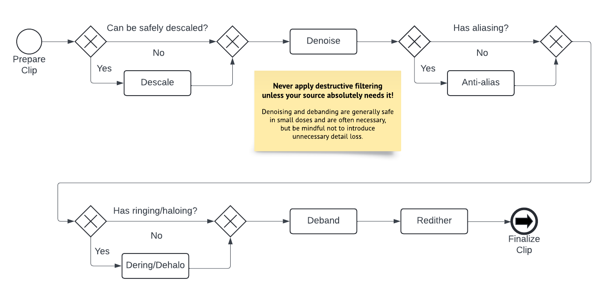

# Order of filtering operations

Deciding which filters to use is important,
but what's arguably even more important
is understanding which order to run filters in.

## Reversing filters

If you're running any filters
that reverse a process
applied by the studio or authoring company,
such as undoing an upscale or lowpass,
you should *always* perform those first.
These types of filters rely on
the "state" of the video
being the same or as close as possible
to the state when the filter was applied.

For example,
anti-aliasing prior to descaling
will modify the lineart too much,
and change it too much to be accurately reversible.
This much may seem obvious,
but where the problem lies
is when you intend to run *multiple* filters
that reverse an operation.

A semi-common example of this
would be an HD source
that is both upscaled
*and* telecined.
The trick to dealing with these
is to imagine what the original process was.
For this example,
it's easy to imagine that telecining
depends on the interlacing being 1px tall.
Else it wouldn't be reversible by a player!
This means that from a production standpoint,
the telecining must be performed last.
Therefore,
if you want to undo an upscale
on a telecined source,
you must IVTC first,
unless you have reason to believe
this was not the original order of operations.

Another example would be
a source that is lowpassed and telecined.
In this case,
you must do a bit more detective work,
as it could reasonably be done in either order.
If there's very weird vertical ringing
that causes issues during inverse telecining,
you may have to merge frequencies first.
However,
if your source only has horizontal ringing,
as is the case with a lot of R2J DVDs,
the order of operations matters a bit less.
This is because neither filter will interfere
with how you would fix the artefact
the other is trying to resolve.

## Generic filtering

With most filterchains
for regular modern titles,
there is a common "accepted" order of filters.

### Descaling

If a source can be safely descaled,
this step should almost always be performed first
for the reasons described in the previous section.

### Denoising

Every consumer source will contain some degree of compression noise,
so it's always a good idea to denoise.
This step may be performed prior to descaling
if the studio or authoring company
added very strong dithering at the end
if it interferes with the descale.
Doing it before descaling
may also significantly speed up certain filterchains.

### Aliasing

Noise around edges may interfere with anti-aliasing,
so this step should be performed after denoising
if necessary.
In an ideal scenario,
anti-aliasing should be scenefiltered
as it's not only a very destructive filter,
but will also slow down your filtering speed by a lot.

### Deringing/Dehaloing

Many of the best anti-aliasing filters
can create some very weak ringing or haloing
in certain scenarios.
Therefore,
it's always safer to perform deringing after
as opposed to before anti-aliasing.
Deringing and dehaloing are very destructive,
so only perform them if absolutely necessary.

### Debanding

Much like denoising,
almost every source will feature
some degree of banding
due to compression.
Much like denoising,
you should not perform any stronger debanding
than is absolutely necessary
to deal with any banding in the source.
If you see very little banding,
a weak protective deband rarely hurts,
so long as you're careful
not to cause unnecessary detail loss.

### Redithering

Redithering helps the encoder
better preserve gradients.
Even with 10 bit video,
there aren't enough colours
to preserve all gradients.
Dithering helps avoid this.
Furthermore,
denoising and debanding
can cause existing dithering
to look "broken up",
or "splotchy".
Dithering again with a grain function
and applying a similar pattern as the source
helps alleviate this.
It's always recommended
to apply dynamic dithering or grain,
even in the rare cases
where your source has static dither.
