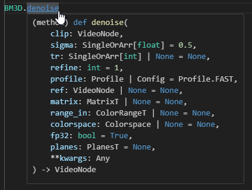

# A Primer on Python

Getting started with Vapoursynth
can seem daunting at first,
as it means
learning how to write Python scripts.
The good news is that Python
is one of the simplest programming languages to learn,
and you only need to grasp the basics
to start filtering videos
with Vapoursynth and JET packages.

!!! danger "Attention"
    This is **NOT** a full guide to using Python,
    and does **NOT** go in to too much depth.
    This is meant to be a high-level guide
    to ease learning enough Python
    to use Vapoursynth with impunity.
    For more in-depth guides,
    consult the [additional resources](#additional-learning-resources) section!

This guide is **NOT**
a comprehensive Python tutorial
and does **NOT**
cover highly advanced topics.
It is designed to provide a high-level overview,
just enough to help you use Vapoursynth effectively.
For more detailed learning,
please check the additional resources section
or ask for support in our [discord server][discord]!

## Basic syntax

Python is a high-level,
interpreted language
that emphasizes readability.
Its basic syntax is designed
to be intuitive and
easy to understand,
making it accessible
even for beginners.

### Variables

Variables are a fundamental concept
in programming
that allow you to store
and reference values
in your code.
Here’s a simple example:

```py
a = 1
b = "example text"
```

In this example:

- `a` is a variable that holds the number 1.
- `b` is a variable that holds a piece of text,
  also known as a "string",
  which is "example text."

Now, let’s see how this translates
to a VapourSynth script.
At the beginning of every script,
you need to load a video file
and assign it to a variable
so you can use it throughout your script.

```py
src = core.bs.VideoSource("a video file.mp4")
```

We load the video,
called "a video file.mp4"
and assign it to the variable `src`.

In this script:

- We use the `VideoSource` function
  from the `bs` module
  to load a video file
  named "a video file.mp4".
- We assign the loaded video
  to the variable `src`.

!!! note "Note"
    There are several common conventions
    that many VapourSynth scripts follow.
    One example is using the variable name `src`
    to represent the source video.
    Following these conventions is highly recommended,
    especially when seeking support,
    as it makes it easier
    for experienced VapourSynth users
    to understand
    and assist you!

While writing your script,
you should be mindful
of the variables you write.
A common mistakes beginners make
is to use an older variable
when they've filtered a clip
and assigned it to a different variable.
Take for example:

```py
src = core.bs.VideoSource("a video file.mp4")

ivtc = core.vfm.VIVTC(src)
decimate = core.vfm.VDecimate(src)
```

The user is passing `src`
to `vfm.VDecimate`,
when what they likely intended to do
was to pass `ivtc` to it instead.
While it's generally considered a good idea
to use different variables
for different filtering operations
(as it makes it easier
to compare multiple filtered clips),
you have to be careful
that you assign
the correct clip
to the function you're calling.

This is how it should be called instead:

```py
src = core.bs.VideoSource("a video file.mp4")

ivtc = core.vfm.VIVTC(src)
decimate = core.vfm.VDecimate(ivtc)
```

### Values

When using functions,
you'll often need to pass
specific values or parameters.
An example of this is the built-in cropping plugin:

```py
src = core.std.Crop(src, ...)
```

The `std.Crop` function
is used to crop a video clip.
It takes parameters for each direction
you want to crop.
Looking at the [VapourSynth documentation](https://www.vapoursynth.com/doc/functions/video/crop_cropabs.html),
it says the function
can be called like this:

```py
std.Crop(vnode clip[, int left=0, int right=0, int top=0, int bottom=0])
```

Let's pick this function apart:

* The first parameter is called `clip`,
  and needs to be a `vnode`.
  This is also known as a `VideoNode`,
  and just means a video clip.
* Every parameter after this is optional,
  which is denoted
  by the square brackets.
* There are four additional optional arguments,
  called `left`, `right`, `top`, and `bottom`.
  Each of them expects an integer value.
  By default,
  the value "0" is passed to them.

For example,
if we want to crop 100 pixels
from the top and right sides
of the `src` clip
we loaded earlier,
we would pass the following parameters
to `std.Crop`:

```py
src = core.std.Crop(src, top=100, right=100)
```

You can also pass parameters
by their position,
though it's oftentimes clearer
to specify them by name:

```py
#                   clip L  R    T    B
src = core.std.Crop(src, 0, 100, 100, 0)
```

A lot of functions don't require you
to pass values for it to return something,
but in most cases,
you'll want to fine-tune these parameters
for your source.
By using an integrated developer environment (IDE),
you can easily check
what each function or method expects.

Using an IDE like Visual Studio Code
can help you understand what values to pass
by showing expected parameters for functions.
IDEs can display parameter names,
their types,
and default values
if the package is properly type-hinted.
This is especially true for JET packages,
which include type hints.

For example,
Visual Studio Code,
a very popular IDE,
can be used to display
the expected parameters
for `BM3D.denoise`:



Here’s a quick guide
to the types of values
you might encounter:

| Type       | Explanation                                                                                  | Notes                     |
| ---------- | -------------------------------------------------------------------------------------------- | ------------------------- |
| Integer    | A round number, like 1, 100, 623, etc.                                                       |                           |
| Float      | A decimal number, like 1.0, 5.2, 236.523, etc.                                               |                           |
| String     | A piece of text encompassed by (double) quotes. For example, "this is a string".             |                           |
| List       | A collection of values. May be annotated with the type of values inside it, e.g., list[int]. | Sometimes called an Array |
| Dictionary | A collection of key/value pairs, e.g., {"name": "value"}.                                    |                           |

JET also uses custom types
like `Kernel`s,
which need to be imported
and created
as per the package guidelines.
If you need help,
resources are often available
in documentation
or community servers
like the [JET Discord Server][discord].

!!! warning "Type-Hinting"
    Not all packages are type-hinted.
    Without type hints,
    an IDE may not display
    the types of parameters
    expected by a function.

### Installing and importing packages

To use JET tooling
and other Python packages,
you'll need to install them
using pip,
Python’s package installer.
For detailed steps,
refer to the [setup guide](../installation/setup.md#installing-the-jet-packages).

Once installed,
you can import packages
into your Python script
using the `import` statement.
There are a couple of ways to do this,
depending on
how you want to access
the functions
from the package.

If you want to import specific functions,
use the `from x import y` syntax:

```py
from vstools import get_y
```

This makes the `get_y` function available
to be used directly:

```py
src_y = get_y(src)
```

You can import multiples functions at once
with this syntax:

```py
from vstools import get_y, get_u, get_v
```

You can also import the entire package:

```py
import vstools
```

When using this method,
you need to reference the function
through the package:

```py
src_y = vstools.get_y(src)
```

!!! warning "Custom namespaces"
    Using custom namespaces
    may make your code cleaner
    and easier to read
    for you,
    but do keep in mind
    that it may make it more difficult
    for experienced VapourSynth users
    to properly support you
    if you run into any issues!

You can also assign
a custom namespace
to your imports
for brevity
or clarity:

```py
from vstools import get_y as gy

src_y = gy(src)
```

```py
import vstools as vst

src_y = vst.get_y(src)
```

### Miscellaneous information

Some quirks
or common VapourSynth script practices
don't fit into any one category,
so we'll discuss them here.

#### Different ways to call a plugin

`core` is used for loading plugins.
In previous examples,
you may have seen it used like so:

```py
core.std.Crop(src, ...)
```

It's not uncommon for script authors
to call plugin functions
directly from the clip.
This is faster to write,
but may make your script
a bit harder to understand sometimes.

```py
src.std.Crop(...)
```

Note that if you call a plugin
via this method,
you no longer have to pass a `vnode`
as the first argument.
This may become a problem
when the plugin expects
a different type
to be passed as its first parameter,
such as `std.StackHorizontal`:

```py
std.StackHorizontal(vnode[] clips)
```

The square brackets shown here
indicate that it expects
a list of `VideoNode`s.
Calling `src.std.StackHorizontal`
will only pass the `src` clip
as an argument,
making it meaningless
to call the function
with this method.

## Additional learning resources

If you want a more hands-on
or practical approach
to learning Python,
there are several valuable resources available.

Here’s a list to get you started:

- [The Python Tutorial](https://docs.python.org/3/tutorial/index.html)
- [Automate the Boring Stuff with Python](https://automatetheboringstuff.com/) by Al Sweigart
- [Video tutorials](https://www.youtube.com/user/schafer5/playlists) by Corey Schafer

[discord]: https://discord.gg/XTpc6Fa9eB
