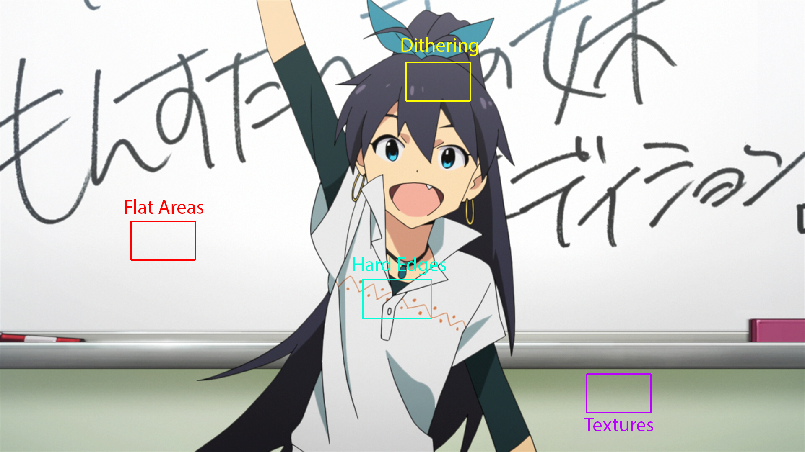

# Recognizing Artifacts

!!! warning "Not a Filtering Guide"

    This page focuses on identifying artifacts
    rather than providing detailed filtering solutions.
    For specific filtering techniques,
    refer to the relevant pages
    in the filtering section of this guide,
    which will be linked throughout
    where applicable.

As a video encoder,
you will inevitably encounter artifacts in your video.
These are flaws in the source material,
and your job
is to fix them
if possible,
or at least
to make them less noticeable.
No video is perfect,
but with a little bit of finesse,
a lot of problems
can be suppressed
or even entirely eliminated.

## Types of Artifacts

Most artifacts
can be broadly categorized
into two distinct
yet closely related types:

1. **Mastering defects**
2. **Authoring defects**

!!! warning "Defect Categories Are Not Absolute"

    While certain artifacts
    tend to appear more frequently
    during specific stages of production,
    any type of defect
    can potentially occur
    at any point in the process.

    For example,
    poor deinterlacing
    is commonly associated with authoring,
    but a studio might also apply it
    during mastering
    or send deinterlaced masters
    to a distributor.
    Similarly,
    compression artifacts
    typically arise during authoring,
    but can also be present
    in the master
    if it was poorly archived
    or transmitted.

### Mastering defects

Mastering defects are imperfections
inherent to the masters.
These typically arise from technical limitations
in the production studio's software and equipment
during the mastering process.
While many mastering defects
are inherent to the original production process,
some may be introduced later
through subpar remastering.

Whether something is a mastering defect
can be somewhat determined
based on the kind of artifact
and its origins.
For example,
for HD productions,
most upsampling-related artifacts
are likely to be caused by
the studio's upscaling process,
not the authoring process.
Additionally,
which artifacts are caused by the studio
can also be determined
by comparing multiple sources
and seeing if the artifact is present
in all of them.

### Authoring defects

Authoring defects are flaws
introduced into the source material
during the authoring process,
such as Blu-ray/DVD authoring,
poor analog-to-digital transfers,
or compression for streaming platforms.
These artifacts commonly originate
from the encoding process
and various authoring tools
used by distribution companies
and streaming services.
As a result,
these defects may appear
on some releases but not others,
even for the same shows.

Most authoring defects
are going to be either compression
or metadata related.
For older titles,
this may also include poor deinterlacing
and/or upscaling[^deinterlacing-upscaling][^poor-sd-upscaling].

[^deinterlacing-upscaling]:
    Poor deinterlacing and upscaling
    tend to go hand-in-hand,
    as to create an HD image
    of an interlaced/telecined source,
    the authoring company
    needs to deinterlace the video
    if they do not want to deal with [cross-conversion].

[^poor-sd-upscaling]:
    Most notorious for poor SD upscaling
    is the authoring company QTEC.
    If you're working with
    a QTEC SD → HD upscale,
    you will likely want to switch gears
    and look at encoding the DVDs instead.

## Trade-offs

A common pitfall
among both new encoders
and those unfamiliar with encoding
is believing that every single artifact
_must_ be fixed.
This is far from the case.
Each filter applied to a video
comes with its own costs and trade-offs,
and it's crucial to understand
when leaving an artifact unfixed
may be preferable to
introducing new problems
through aggressive filtering.
Nearly every single filter
has the potential
to degrade video quality
in some way.

There are some exceptions
to this general rule,
particularly with filters
that perform the _mathematical inverse_
of a known operation.
A prime example is _descaling_,
which [reverses the upscaling process](../filtering/common/descaling/theory.md)
to remove artifacts
introduced during upscaling,
while allowing you to re-upscale the image
using a much better algorithm.
However, even these "inverse" filters
will cause issues if misapplied,
and come with their own limitations
and requirements.

When deciding whether to apply filtering,
you should carefully weigh the benefits
against any potential drawbacks.
If you're confident
the pros outweigh the cons,
then proceed with the filter.
But if you're uncertain
about potential side effects,
it's often better to either
skip the filter entirely
or thoroughly [compare the results](../misc/comparison.md)
to ensure the trade-offs
are worthwhile.

## Frame Composition

Before you can effectively identify
and address artifacts,
it's essential to understand
the fundamental components
that make up a frame.
Different regions within a frame
have distinct characteristics
that make them more or less susceptible
to specific types of artifacts.

The following sections break down
the key regions you'll encounter
and how they interact
with various artifacts.
By learning to recognize
these distinct areas,
you'll be better equipped to:

1. Identify where artifacts
   are most likely to appear
2. Understand why certain artifacts
   occur in specific regions
3. Make informed decisions
   about trade-offs
   in your filtering choices

!!! example "Different types of regions of a frame"

    

It's recommended
you open this image
in a new tab
and zoom in on it
to get a better look
at the different regions.

### Flat Areas

Flat areas are regions in a frame
characterized by low-frequency components
and minimal pixel-to-pixel variations.
These areas tend to have very subtle color
and brightness transitions,
if any at all.

Due to their uniform nature,
flat areas are particularly susceptible
to artifacts like banding,
blocking,
and quantization noise.

Common examples include:

- Solid colored backgrounds (e.g., title cards, UI elements)
- Clear, cloudless skies
- Smooth surfaces like walls, skin, or polished materials
- Uniform gradients (e.g., lighting transitions, shadows)
- Out-of-focus backgrounds ([bokeh](https://en.wikipedia.org/wiki/Bokeh))

### Hard Edges

Hard edges encompass any sharp,
clearly defined transitions
between different regions in an image.
These edges provide high contrast
between objects and their surroundings.

Hard edges are high-frequency information,
and are therefore particularly susceptible
to compression artifacting,
as well as artifacting
that results from poor upscaling,
such as ringing, aliasing, and blurring.

Common examples include:

- Character line-art
- Text and subtitles
- Sharp boundaries between objects in the background
- Geometric shapes and patterns
- Architectural features like window frames or building edges
- Strong shadow boundaries

### Textures

Textures are more complex
and can contain a mix of high-frequency
and low-frequency information.
This makes it difficult
to target them specifically
without introducing unwanted detail loss.

Textures are often found in:

- Complex patterns like wallpaper or floors
- Natural elements like wood, stone, or fabric
- Detailed backgrounds like foliage or water

### Dithering

Dithering is a technique
used to help prevent banding
and other color break-ups
during compression.
This is not an artifact
in and of itself,
but it can be difficult
to immediately recognize
the difference between dithering and textures,
and dithering and compression noise.
The big thing
that usually sets them apart
is the noise structure.
Dithering is usually random,
while textures are usually structured.
Noise can still be somewhat random
both spatially and temporally,
but usually has a discernible structure.

The [colors of noise](https://en.wikipedia.org/wiki/Colors_of_noise) applied for dithering
will impact the noise structure
as well as which frequencies
they are most visible in.
Some colors will be more difficult to get rid of,
and may require leaving alone.
In almost all cases,
you will want to try to match
the original noise color
when redithering
at the end of your filtering script.

| Noise Color  | Description                                                     |
| ------------ | --------------------------------------------------------------- |
| White noise  | Equal intensity at all frequencies                              |
| Blue noise   | Concentrates energy in higher frequencies, perceptually uniform |
| Violet noise | Intensity increases with frequency                              |
| Pink noise   | Intensity decreases with frequency                              |
| Brown noise  | Intensity decreases more steeply with frequency                 |

## Spatial vs. Temporal

Artifacts can appear either spatially,
temporally,
or as a combination of both:

- **Spatially**
  (static,
  easily visible in a single frame)
- **Temporally**
  (dynamic,
  visible only in motion)

Spatial artifacts are visible
when looking at a single frame,
and generally stay static
from frame to frame.
These include things like:

- Banding in gradients
- Ringing around edges
- Aliasing
- Blurring from poor upscaling

Temporal artifacts only become visible
when watching the video in motion.
Common examples include:

- Shimmering
- Flickering
- Motion judder
- Interlacing

Temporal artifacts are more difficult to fix
and will require motion compensation
to some extent,
which is also rather expensive
in terms of processing power.

## Artifacts

!!! warning "This section is incomplete!"

    This section is a stub.
    You can help us
    by [expanding it](https://github.com/Jaded-Encoding-Thaumaturgy/JET-guide?tab=readme-ov-file#contributing).

    ??? question "How can I help?"

        - Add more examples
        - Add more explanations
        - Write about other artifacts

!!! warning "Not Exhaustive"

    This list covers artifacts
    you are likely to encounter,
    but is **_not_** exhaustive.
    Many artifacts
    can manifest in different ways
    or combine characteristics
    of multiple categories
    (for example,
    poor upscaling can cause blurring,
    aliasing,
    and ringing).
    When diagnosing issues,
    focus on understanding
    the underlying causes
    rather than strict categorization.

### Banding

!!! example "Frame with banding"

    !!! info "Exposure"

        This frame has additional exposure
        applied to it
        to help make the banding more visible
        in the marked region.

    

Banding is one of
the most prevalent artifacts
in digital video.
It appears as visible "steps" or bands
in what should be smooth gradients,
such as in skies,
shadows,
or other areas
with color transitions.
This artifact occurs
when there isn't enough precision
to represent subtle color
and brightness variations smoothly.
There are two main causes:

1. The video was encoded
   with an insufficient bit depth,
   meaning there aren't enough distinct values
   to represent smooth gradients.
2. During production,
   processing was done
   at a low bit depth,
   introducing banding
   that gets "baked in"
   to the final output.

Most modern production workflows
use 16-bit color precision
during editing
and VFX work.
For final distribution,
this is usually reduced to 10-bit,
which is generally sufficient
for most content.
However,
most consumer video content
is further reduced to 8-bit color,
which only allows 256 distinct values
per color channel.
This significant reduction
in color precision
often makes banding visible,
especially in scenes
with subtle gradients
and darker areas of the image[^banding-video].

[^banding-video]:
    Tom Scott's [Why dark video is a terrible mess](https://www.youtube.com/watch?v=h9j89L8eQQk)
    goes into more detail
    on why this happens.

| Bit Depth | Colors Per Channel |
| --------- | ------------------ |
| 16-bit    | 65536              |
| 10-bit    | 1024               |
| 8-bit     | 256                |

The process
to fix this
is called "debanding".
Additional dithering is usually
applied after
to preserve the gradient
during the encoding stage.

#### Chroma banding

In some cases,
banding may be more noticeable
in the chroma planes
than in the luma plane.
This is because
the chroma planes
are often compressed
more heavily than the luma plane.

!!! example "Frame with chroma banding"

    

These often manifest as visible bands
of different colors,
as opposed to different luminosities
like with luma banding.

This can be fixed in the same way regular banding is fixed,
but applied to the chroma planes specifically.
This can be destructive, however,
as chroma is much blurrier than luma.

### Aliasing

Aliasing is a sawtooth-like artifact
that occurs on hard edges.
It is caused by a lack of high-frequency information,
and is often a sign of poor upscaling
or a lack of proper line smoothing.

There are four common causes
of aliasing:

1. Poor upscaling algorithms
2. Poor (3D) rendering
3. Binarized line art that wasn't smoothed
4. Stylistic choices

#### Poor upscaling algorithms

Poor upscaling algorithms are the most common source
of aliasing artifacts.
When an image is upscaled,
the algorithm must create new pixels
to fill in the gaps.
Most basic algorithms
struggle to handle sharp transitions smoothly,
resulting in jagged edges
and stair-stepping patterns.

!!! example "Frame with aliasing"

    <!-- TODO: Get a frame -->

    

#### Poor (3D) rendering

Poor rendering can cause aliasing
in the same way
that poor upscaling can.
3D rendered content especially
is prone to aliasing
when the rendering process
lacks sufficient anti-aliasing or line smoothing.
This is particularly noticeable
on high-contrast edges
and fine geometric details.

!!! example "Frame with aliasing"

    <!-- TODO: Get a frame -->

    

Non-poor 3D rendering
is common in western cartoons,
resulting in an overall very jagged look.

!!! example "Frame with aliasing"

    <!-- TODO: Get a frame from Generator Rex -->

    

#### Binarized line art that wasn't smoothed

During animation production,
frames are _binarized_
to create clean, sharp lines
for the coloring process.
This step is normally followed by
line smoothing to prevent aliasing.
However,
if this smoothing step is skipped,
the resulting lines will still be aliased.

!!! example "Frame with aliasing"

    <!-- TODO: Get a frame -->

    

#### Stylistic choices

Modern animation sometimes employs
deliberately jagged or pixelated lines
as a stylistic element.
These artistic choices are usually obvious
and should be preserved rather than "fixed"
through anti-aliasing.

!!! example "Frame with intentionally jagged lines"

    <!-- TODO: Get a frame from Occultic;Nine or Granblue Fantasy -->

    

### Ringing

Ringing refers to visible ripples or halos
that appear next to sharp lines
or edges in an image.

Ringing is typically caused by processes
like resampling or compression,
and is often most noticeable
when the image has sharp transitions
or has been subjected to aggressive processing.

This artifact can appear on all planes,
but is often most noticeable
on the luma plane.

!!! example "Frame with ringing artifacts on all planes (but especially the chroma planes)"

    

#### Haloing

Haloing is a type of ringing
that appears as a halo around an object.
It is often caused by poor upscaling
or post-sharpening.

!!! example "Frame with haloing"

    

Not all haloing is necessarily unintended.
In some cases, it may be deliberately applied
by the studio during compositing
to help create a stronger contrast between the object and the background.
This will most often manifest as a heavily blurred glow,
and should not be dehaloed.

Common ways to fix haloing
is by dehaloing.
There are multiple filters for this,
but they all do basically the same thing:
blur the areas around lineart
and limit damage to the lineart itself.

#### Border ringing

Border ringing is categorized
as ringing that appears on the borders of the image.
This is often caused by upsampling.

!!! example "Frame with border ringing"

    

During upsampling,
border pixels must be extrapolated
beyond the original image.
A lot of upscaling algorithms
use black pixels to pad the image,
which causes visible ringing artifacts.

As this is most often a result of upsampling,
[desampling](../filtering/common/descaling/theory.md)
with the proper border handling
is often the solution.
Furthermore,
the number of rings
can aid in determining
the kernel used for upsampling.

Border ringing may also be visible
on letterboxed content,
as the borders are often padded
with black pixels.

!!! example "Frame with border ringing on letterboxed content"

    

This can be fixed in the same way,
but note that the chroma may not perfectly align
with the luma depending on how it was padded.

#### Lowpass filters

A common source of ringing is lowpass filtering.
Lowpassing is a technique
used to remove high-frequency noise
from a signal,
often for compression or denoising purposes,
but it can and often _does_ introduce ringing.

!!! example "Frame with ringing from lowpassing"

    

This artifact is most commonly seen on DVDs,
where lowpass filtering is typically applied twice
along the horizontal axis.
This process causes pronounced horizontal ringing
and significant blurs the lineart.

A common way to determine if a source
is affected by horizontal-only resampling
is to check an FFT spectrum.
The FFT spectrum
will show a clear absence
of high frequency information
on the horizontal axis.

!!! example "FFT spectrum of an HDCAM SR master"

    

One way to address this
is to make a "difference"
between the lowpassed source
and a clean (non-lowpassed) reference source,
then apply this difference
back to the lowpassed source
to reduce the ringing
and restore the original lineart clarity.

#### HDCAM SR

!!! example "Frame with ringing from HDCAM SR"

    

Another common source of excessive ringing is horizontal-only resampling
common with HDCAM SR masters.
These masters are resampled horizontally from 1920x1080 → 1440x1080 → 1920x1080,
often with a ringing kernel such as Lanczos,
which not only causes a lot of damage to the image quality,
but also introduces very strong horizontal-only ringing.

!!! example "FFT spectrum of an HDCAM SR master"

    

Much like with lowpassing,
one way to determine if a source
is affected by HDCAM SR
is to check an FFT spectrum.
The FFT spectrum
will show a clear absence
of high frequency information
on the horizontal axis.
The difference here is that
the "lowpassing" is caused by the downsampling,
whereas lowpassing will not affect
the output resolution directly.

Ringing caused by HDCAM SR mastering
is often impossible to remove,
as when it happens,
that means the master is usually stored with HDCAM SR,
not an intermediary master from the distributors.
In some cases, clean sources may be available[^toei-one-piece],
but this is rare.
If such a source _is_ available,
the method to fix it is the same
as it is for other lowpass filtering,

[^toei-one-piece]:
    An example of one such case
    is the WEB source
    for One Piece's modern episodes.
    The blu-rays for this show
    use HDCAM,
    but the WEB masteres do not,
    allowing you to delowpass the BD source
    using the WEB source
    to fix the ringing.

### Noise

#### DCT noise

#### Grain

### Blocking

Blocking is a type of artifact
that appears as blocky patterns
in the image,
and is often caused by compression.

!!! example "Frame with blocking artifacts"

    

As this is a compression artifact,
denoising and debanding is usually enough
to smooth out block boundaries.
In more severe cases,
dedicated deblocking filters
such as those found in encoders' in-loop filters
or deblocking plugins like [VapourSynth-Deblock](https://github.com/HomeOfVapourSynthEvolution/VapourSynth-Deblock)
can be used to further reduce blocking.

### Range compression/expansion

#### Luma overflow/underflow

### Interlacing

#### Combing

#### Orphan Fields

### Shimmering

### Cross-conversion

### Blending

### Dimming

### Point-scaled chroma

### Chroma shift

### Chroma bleed

### Rainbowing

### Dotcrawl

#### Double composite

### IRE units

### Scanning defects

<!-- TODO: Use that example from ToHeart2's Nozomi or ADV edit -->

### Cel degradation
