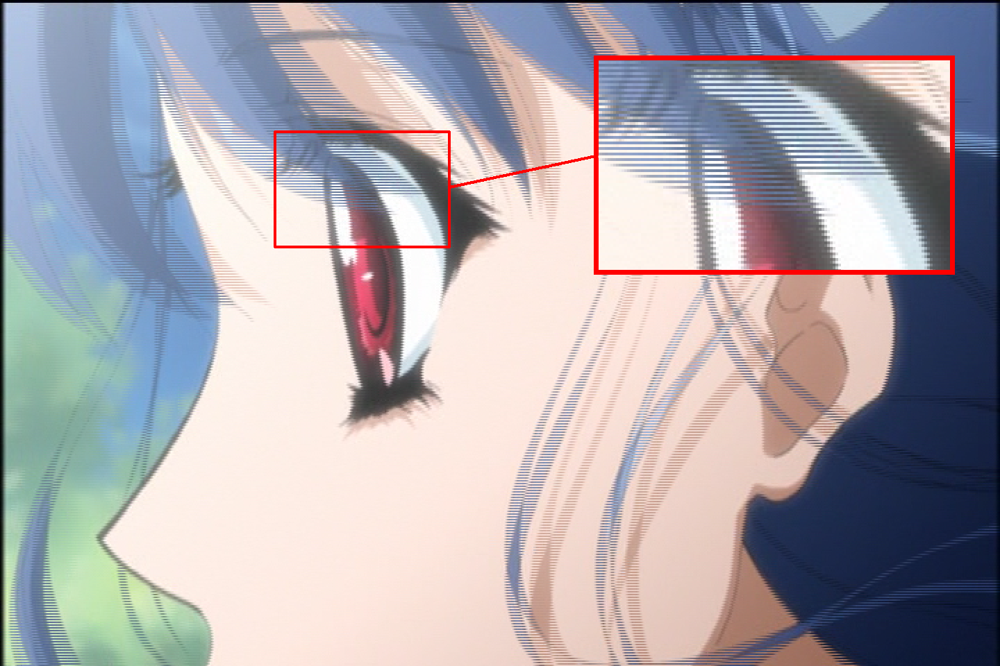

# Field-Based Video

When working with DVDs
and other older video sources,
you'll often encounter
what's known as "field-based" video.
This guide will explain
what field-based video is.

!!! example "Combed frame"

    

!!! warning "NTSC vs. PAL"

    While both NTSC and PAL use field-based video,
    this guide focuses exclusively on NTSC.
    PAL introduces additional complexities
    that make it significantly harder to understand,
    process,
    and restore video to its original state.

## What is a video?

At its most basic level,
a video is a series of pictures
(called frames)
displayed in sequence
at specific intervals.
The rate at which these frames are displayed
is known as the framerate,
typically measured in frames per second (fps).

When you play a video on your computer,
you're usually seeing
what's called "frame-based"
or "progressive" footage.
Each frame is a complete picture
on its own,
with no special storage
or display requirements.

However,
not all footage works this way.
Some video,
particularly from older sources
or certain broadcast formats,
is stored in what's called
a "field-based" format.

## Fields and Frames

There are several key differences
between these two storage formats.

### Frame-Based (Progressive) video

Frame-based footage,
also known as progressive video,
is straightforward:

- Each _frame_ is a complete,
  self-contained picture
- All rows of pixels are captured
  at the same moment in time
- The frames are displayed sequentially,
  one after another

Here's a visualization
of sequential frames
in progressive video:

    

        
A

    

    

        
B

    

    

        
C

    

    

        
D

    

### Field-Based (Interlaced) video

Field-based video works differently:

- Each frame is divided into two _fields_
- One field contains the even-numbered rows (top field),
  the other contains the odd-numbered rows (bottom field)
- Each field can capture a different moment in time

!!! info "Field Order"

    Field orders can vary
    depending on how the footage was shot.
    The two common field orders are:

    - Top Field First (TFF):
      The top field comes from an earlier point in time
      than the bottom field
    - Bottom Field First (BFF):
      The bottom field comes from an earlier point in time
      than the top field

    Using the wrong field order
    will result in jerky motion
    and visual artifacts.

    This guide will explain concepts
    assuming _Top Field First_.

This format was originally developed
for CRT televisions,
which could only draw half the lines
of a frame at once.
By alternating between even and odd lines,
they could display video
at a higher perceived framerate
while using less bandwidth.

## Types of Field-Based footage

!!! danger "Know what you're working with"

    It is vitally important
    to recognize which type of field-based video
    you're working with
    before taking any action,
    as each requires a completely different approach.
    This information can **NOT**
    be determined from MediaInfo alone.
    You must visually inspect
    multiple consecutive frames manually
    to observe how the fields interact over time
    to identify whether the video
    is interlaced or telecined.

There are two main types
of field-based footage:

1. **Interlaced Footage**:
   Where each field represents a complete picture
   at a different point in time
2. **Telecined Footage**:
   Where fields are used to convert
   between different framerates
   (like 23.976 fps to 29.97 fps)

### Interlaced footage

In interlaced footage,
each field captures a unique moment in _time_.
Unlike progressive video
where each frame represents a single instant,
interlaced video interleaves
two different temporal samples
into a single frame:

1. The top field contains even-numbered rows
   from one moment
2. The bottom field contains odd-numbered rows
   from the next moment
3. Each field has half the vertical resolution
   of a full frame

    

        
A

        
B

    

    

        
C

        
D

    

    

        
E

        
F

    

    

        
G

        
H

    

    

        
I

        
J

    

For any given frame:

$$
\text{Frame}_n = \begin{cases}
\text{Top Field} &= \text{Time}_n \\
\text{Bottom Field} &= \text{Time}_{n+1}
\end{cases}
$$

When displayed on a CRT monitor,
this temporal interleaving appeared smooth
because CRTs draw the image line-by-line,
from top to bottom.
Each field would be displayed sequentially,
with the phosphors from the previous field
naturally fading before the next field was drawn.
Modern displays work entirely differently,
and will simply render full frames at a time,
making the interlacing visible.

### Telecined footage

Telecined footage is more complex.
It's a process used to convert film
(typically 23.976 fps)
to broadcast formats
(typically 29.97 fps)
by duplicating and blending fields
in a specific pattern.

This conversion is necessary
because film (23.976 fps)
and broadcast video (29.97 fps)
have different framerates,
with a ratio of 4:5 frames:

$$
\frac{23.976}{29.97} = \frac{4}{5}
$$

The most common pattern
is 3:2 pulldown
(also called 2:3 pulldown),
which converts 23.976 fps film
to 29.97 fps video
by duplicating and rearranging fields
from 4 film frames (8 fields)
to create 5 frames for broadcast (10 fields).

    

        
A

        
A

    

    

        
B

        
B

    

    

        
B

        
C

    

    

        
C

        
D

    

    

        
D

        
D

    

This creates a repeating pattern
of 2-3-2-3 field duplicates,
where:

- Frame A is shown for 2 fields
- Frame B is shown for 3 fields
- Frame C is shown for 2 fields
- Frame D is shown for 3 fields

$$
\frac{A^1 - A^2 - B^1 - B^2 - B^1 - C^2 - C^1 - D^2 - D^1 - D^2}{2-3-2-3}
$$

The combed frames occur
where fields from different source frames
are interlaced together
(B/C and C/D frames).
These hybrid frames contain fields
from two different moments in time,
creating the "combing" artifact.
As this method follows a set pattern,
it's _reversible_.
This process is called
"inverse telecine" (IVTC).

The key difference between telecined
and interlaced footage
is that with telecining,
the fields originate from progressive film frames,
meaning we can reconstruct the original frames
by identifying and reversing the telecine pattern.
With interlaced footage,
the fields were captured at different moments in time,
so there is no "original" progressive frame to recover.

## Cycles and Pattern Breaking

When working with inverse telecine (IVTC),
it's helpful to think about the video
in terms of cycles.
For telecine specifically
(23.976 fps film to 29.97 fps video),
each cycle takes 4 film frames
and distributes them across 5 video frames,
creating a cycle of 10 fields or 5 frames total.

The telecine pattern frequently "breaks"
due to video editing practices.
Since editing historically occurred
after telecining the footage,
cuts between scenes and added transitions
would disrupt the underlying 2-3-2-3 sequence.
The editing process paid no attention
to maintaining pattern consistency,
leading to broken cycles throughout the video.

These breaks create "orphaned fields":
fields that have lost their matching pair
from the original film frame.
Orphaned fields cannot be properly reconstructed
into their source progressive frames,
as their matching field no longer exists.

    Scene A

    <!-- Scene A ending -->
    

        
A

        
A

    

    

        
B

        
B

    

    

        
B

        
C

    

    <!-- Scene cut happens here -->
    
Scene Cut Prematurely →

    Scene B

    <!-- Scene B starting -->
    

        
A

        
A

    

    

        
B

        
B

    

    

        
B

        
C

    

    

        
C

        
D

    

    

        
D

        
D

    

Looking at Scene A,
we can observe how the telecine pattern
becomes disrupted at the scene change.
The sequence begins normally,
following the expected 2-3-2-3 pattern
through frames A and B.
However, when reaching frame C,
only the top field (C1) exists
before the scene cuts away.
This leaves C1 as an orphaned field
with no matching bottom field
to complete the progressive frame.

The most common solution
is to drop either the next
or previous field,
depending on the type of orphan.
However, this can create a noticeable "hiccup"
during playback in scenes with significant motion
prior to the scene change.

## Variable Framerate Footage

In the early digital era,
many studios were still experimenting
with digital tooling.
This included working directly on 60i video,
as well as mixing different framerates together.
This commonly manifests in two ways:

1. Mixing film and video sources
2. Adding post-production effects in 60i

A common example in anime
is interlaced credits overlaid
on telecined animation.
When examining individual fields,
you may notice certain elements
are unique in each field,
indicating true interlaced content.
However, since the underlying animation
is still 23.976 fps content,
standard deinterlacing approaches
may cause significant damage.

!!! example "Interlaced credits"

    

In some cases,
certain elements may be animated
at different framerates natively.
These can include:

- Panning shots and zooms
- Background animations
- Video effects and CGI elements
- Text overlays and credits
- Fade transitions

These elements are often produced
at 29.97 fps natively,
but are broadcast at 60i
alongside the telecined footage.
This creates segments where
the underlying telecine pattern is lost,
and special handling is required
to properly reconstruct the content.

To properly preserve mixed framerate content,
you must output a Variable Framerate (VFR) video
or store frame timing information
in an external file for muxing.
Different segments need different framerates:

- Telecined scenes: 23.976 fps after IVTC
- Native 29.97 fps content: 29.97 fps
- Deinterlaced segments: Usually 59.94 fps

??? question "How did people do this in the past?"

    In the past,
    hobbyist encoders had limited options
    for handling mixed framerate content.
    Common workarounds included:

    - Converting everything to 23.976 fps,
      sacrificing motion smoothness
    - Keeping telecined content at 29.97 fps
      while decimating interlaced segments,
      resulting in a consistent
      but suboptimal 29.97 fps output
    - Converting all content
      to a common multiple framerate
      like 119.88 fps
      through frame duplication
      or interpolation

    These approaches often resulted
    in compromised visual quality
    compared to modern VFR solutions,
    and as such are generally not recommended.

Some exceptions exist,
such as cross-fades
or 59.94 fps credits
overlaid on lower framerate content,
which you may want to pull down
to your target framerate.
The mix of telecined and interlaced content
means that a single deinterlacing approach
won't work for the entire video.

## Unfixable patterns

In some extreme cases,
field-based content may be "unfixable"
regardless of the techniques used.
This can happen in several scenarios:

- Multiple overlaid telecined patterns
  on different layers creating conflicting patterns
  that force deinterlacing
- Zoomed or panned telecined footage
  where the original fields become unrecoverable
- Footage that has been processed multiple times
  with different field orders
- Effects applied directly to fields
  rather than complete frames

In many of these cases,
deinterlacing is the only viable solution.
However, some content may be damaged
beyond what even deinterlacing can fix,
leaving you with no way
to create clean progressive frames.

!!! example "Unrecoverable telecined frame due to zoom"

    

    This frame from _Kino no Tabi (2003)_
    has been zoomed in
    while still in its telecined state.
    The zoom operation has permanently altered
    the field information,
    making it impossible to recover
    the original progressive frame
    through either inverse telecine
    or deinterlacing.

## Common Misconceptions

Here are some frequent misunderstandings
about field-based content
that can lead to improper handling:

- **"MediaInfo says interlaced, so it must be interlaced"**

MediaInfo and similar tools can only detect
if content is _stored_ in a field-based format,
not whether it's truly interlaced or telecined.
You _must_ manually inspect the video
to determine this.

- **"I can just deinterlace everything"**

Blindly deinterlacing all field-based content
is a common but destructive approach.
Deinterlacing telecined content
unnecessarily destroys detail
and introduces artifacts.
_Always_ identify the content type first
to choose the appropriate processing method.

- **"The whole video must be the same type"**

Professional content often mixes
different types of field-based content
within the same video.
This means you may need to handle
different segments with different methods.
For example, a video might contain
both telecined film content
and true interlaced video segments,
requiring a hybrid approach
to properly process the entire file.

## Filtering

Now that you understand
the different types of field-based content,
the following guides will walk you through
the appropriate filtering techniques
for each scenario:

- [Inverse Telecine with Wobbly](../../sources/dvd/wobbly/installation)
