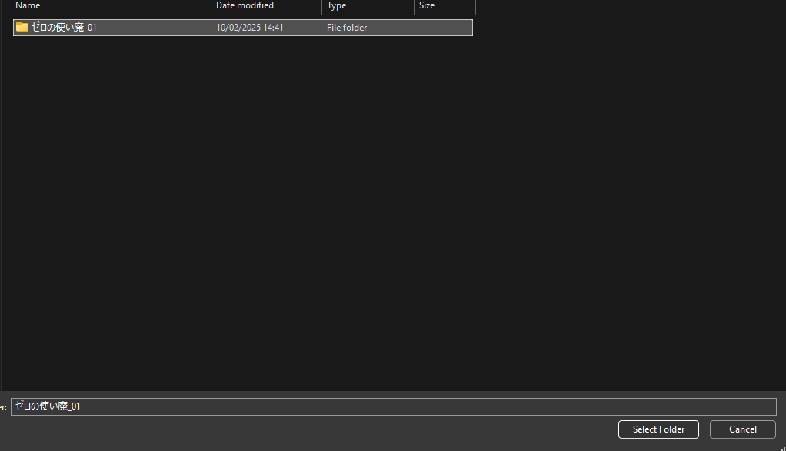
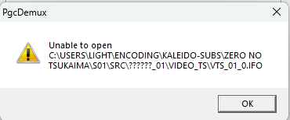
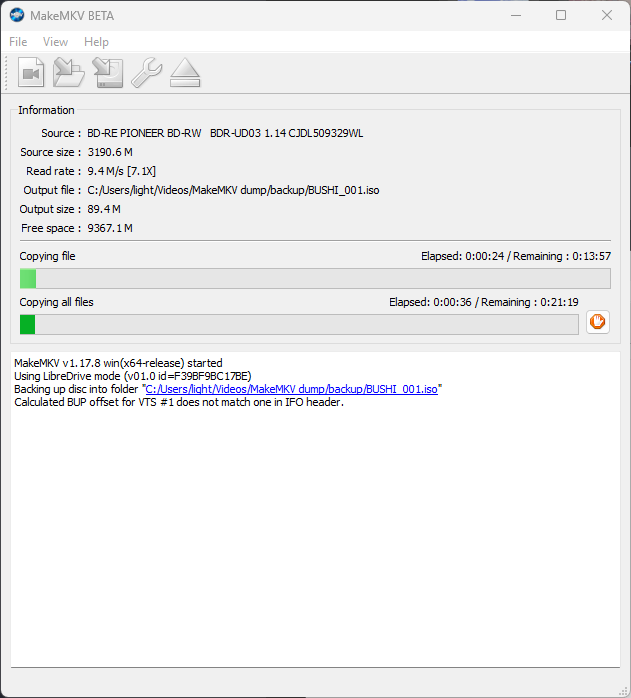

# Remuxing DVDs

When working on DVDs,
it helps a lot to have a clean mux
of each episode ready.
To do this,
you will need to remux the DVDISO,
and somehow split the remux into individual episodes.
This guide will cover different methods to accomplish this,
as well as cover some additional information
that's useful if you want to release a DVD remux.

## Understanding DVD Structure

There are multiple ways to remux a DVDISO.
However, it's also important
to understand _what_ you are remuxing.
DVDISOs are made up of the following:

- **Titles**: The main content units on a DVD. Each title typically contains one episode, movie, or bonus feature. These may also contain multiple episodes in one big title.
- **Angles**: Alternative video streams within a title, often used for different versions of the same content (such as theatrical and director's cut versions).
- **Chapters**: Markers within a title that allow skipping to specific points, like scene transitions or commercial break points.

Each of these elements can be important
depending on what you're trying to preserve.
For a basic episode remux,
you'll typically want to focus on the main title and chapters.
However, for a complete preservation,
you might want to capture all available angles as well.

## Remuxing Methods

Below are multiple methods to remux your DVDISO,
in order of safest to least safe:

!!! example "Different remuxing methods"

    === "FFmpeg"

        !!! warning "Version"
            This method requires FFmpeg 7.0 or later!
            If you are using an older version,
            you will need to upgrade.<br>
            You can find the latest BtbN builds [here](https://github.com/BtbN/FFmpeg-Builds/releases/download/latest/ffmpeg-n7.1-latest-win64-gpl-7.1.zip).

        !!! info "Documentation"
            For more information on the command line arguments,
            see the [FFmpeg documentation](https://ffmpeg.org/ffmpeg-formats.html#dvdvideo).

        FFmpeg can be used to help split a DVDISO by Title, Angle, or Chapters.

        You will ideally want all of the above,
        and the most straight-forward way to find them
        is by using [MPC-HC](https://github.com/clsid2/mpc-hc)
        (note that VLC and mpv do not support this functionality
        as of the time of writing).

        !!! example "How to view your DVD"

            === "ISO"

                === "From MPC-HC"

                     1. Open MPC-HC
                     2. Hover over the _Files > Open File_ button
                     3. Select your DVDISO

                     

                === "From Explorer"

                    1. Navigate to your DVDISO
                    2. Right click on it
                    3. Select "Open with"
                    4. Select MPC-HC
                        1. If you can't see it in the list, press "Choose an app on your PC"
                        2. Find the mpc-hc.exe file
                        3. Click on it.

                     

            === "Physical DVD"

                1. Insert your DVD into your DVD drive
                2. Open MPC-HC
                3. Hover over the _Files > Open Disc_ button
                4. Select your DVD drive

                 

            === "Unpacked DVD"

                5. Open MPC-HC
                6. Hover over the _Files > Open DVD/BD button_
                7. Navigate to the directory containing your unpacked DVDISO
                8. Click on the folder the DVD was unpacked into
                9. Click "Select folder"

                

            !!! info "Skipping to the menu"
                You can click _Navigate > Title Menu_ to skip the trailers/warning
                and get straight to the menu.

        You should now be able to see the DVD content.

        

        You will want to take note of whether there are individual titles for each episode,
        or if they're all in one big title.
        You can check this by clicking on the titles in _Navigate > Titles_.

        If they're all in one big title,
        you will need to figure out how to split them.
        You can find the split points by referencing the chapters.
        These can be found on the timeline,
        or by using the _Navigate > Chapters_ menu.

        If you want to preserve the original video as closely as possible,
        you'll also want to take note of the angles.
        If there are multiple angles,
        they can be found in _Navigate > Angles_.

        To remux the DVDISO,
        you will need to use the following command
        based on your needs:

        !!! example "Demuxing with FFmpeg"

            === "Title with chapters"

                ```bash
                ffmpeg -f dvdvideo -i "<input_file>" -preindex True -title <title> -map 0 -c copy "<output_file>"
                ```

                Replace the following keys:

                - `<input_file>`: The path to your DVDISO
                - `<title>`: The number of the title you want to remux (integer between 1 and 99)
                - `<output_file>`: The path to the output file

            === "Title with multiple episodes"

                ```bash
                ffmpeg -f dvdvideo -i "<input_file>" -preindex True -title <title> -chapter_start <chapter> -chapter_end <chapter> -map 0 -c copy "<output_file>"
                ```

                Replace the following keys:

                - `<input_file>`: The path to your DVDISO
                - `<title>`: The number of the title you want to remux (integer between 1 and 99)
                - `<chapter_start>`: The number of the chapter to start at (inclusive)
                - `<chapter_end>`: The number of the chapter to end at (inclusive)
                - `<output_file>`: The path to the output file

            === "Title with a different angle"

                ```bash
                ffmpeg -f dvdvideo -i "<input_file>" -preindex True -title <title> -angle <angle> -map 0 -c copy "<output_file>"
                ```

                Replace the following keys:

                - `<input_file>`: The path to your DVDISO
                - `<title>`: The number of the title you want to remux (integer between 1 and 99)
                - `<angle>`: The number of the angle you want to remux (integer between 1 and 9)
                - `<output_file>`: The path to the output file

            === "Menus"

                ```bash
                ffmpeg -f dvdvideo -i "<input_file>" -menu True -pgc <pgc> -map 0 -c copy "<output_file>"
                ```

                Replace the following keys:

                - `<input_file>`: The path to your DVDISO
                - `<pgc>`: The PGC number you want to remux (integer between 1 and 99)
                - `<output_file>`: The path to the output file

        !!! question "Converting PCM audio to FLAC"
            If your DVDISO has PCM audio
            (which you can figure out
            by checking the file
            in either FFprobe or MediaInfo),<br>
            you may want to convert it to FLAC.
            You can do that
            by adding the following parameter
            after `-c copy`:

            ```bash
            -c:a flac -compression_level:a 12
            ```

            If you have any tracks that are not PCM,
            you can prevent them from being converted
            by replacing `-c:a` with `-codec:stream_id`,
            where `stream_id` is the ID of the track
            you want to convert.
            You will need to add one of these
            for each track
            you want to convert.

    === "PgcDemux"

        !!! warning "Binaries"
            This program is only available as a Windows binary.
            If you are on Linux,
            you may need to build it from source yourself
            (which is also included in the link).

        PgcDemux is a tool
        that allows you to demux a DVDISO
        into individual "titles" and "menus".

        The download link can be found here:

        - [Jsoto's Vob/Ifo tools](https://download.videohelp.com/jsoto/dvdtools.htm)

        In order to use this program,
        you will need to have an unpacked DVDISO.
        Some downloads will come unpacked,
        but if you have a compressed ISO,
        you will need to unpack it first.
        This can be done with either WinRAR or 7-Zip.

        

        Once you have an unpacked DVDISO,
        you can open PgcDemux
        and drag the `VTS_XX_0.IFO` file,
        where "XX" can be any two digits,
        into the "Input IFO" box.
        Make sure to also set an output directory.

        Do take note of the path name!
        PgcDemux does not work
        if there are unicode characters
        in the path,
        such as Japanese characters.

        

        Once you have dragged the file into the program,
        you will see a window like the following:

        

        There are three modes
        to choose from.
        For our purposes,
        we will be using the "By PGC" mode.

        ??? question "What are PGCs?"
              PGCs are a way to organize the video streams on a DVD.
              For more information,
              see [this page](https://dvd.sourceforge.net/dvdinfo/pgc.html).

        You can select different PGCs in the "PGC Selection" box.
        Under the dropdown menu, you can find invididual titles:

        

        In most cases, these will be split into individual episodes.
        If that's not the case,
        like here,
        you may need to split them manually later.

        Once you have selected the PGC,
        look at the box to the left.
        You will see a list of demuxing options.
        Set these to the following:

        

        Once you have set the options,
        you can click the "Process!" button
        to begin the demuxing process.
        This will output the files into your output directory.

        

        If the episodes are not split into individual files,
        you will need to split them manually.
        This can be done by remuxing the DVDISO
        using [mkvtoolnix](https://mkvtoolnix.download/)
        and splitting by time under the "Output" tab.

        

    === "MakeMKV"

        !!! danger "MakeMKV"
            MakeMKV is perhaps the easiest method
            to remux a DVDISO,
            but it's been known
            to create broken remuxes from time to time.
            Use this method
            at your own risk!

        !!! warning "Input file"
            MakeMKV requires a DVDISO
            or physical disc
            to work.
            If you only have an unpacked DVDISO,
            you will need to use a different method.

        MakeMKV can be downloaded from the following link:

        - [MakeMKV](https://www.makemkv.com/)

        Once you have downloaded and installed MakeMKV,
        you will need to register it.
        A free key can be found [here](https://forum.makemkv.com/forum/viewtopic.php?t=1053).

        !!! example "Selecting titles"

            === "ISO"

                click the "Open File" button
                and select your DVDISO.
                It will start processing the file,
                and then show you this window:

                

            === "Physical disc"

                Insert your physical disc.
                MakeMKV will automatically detect it,
                and then show you this window:

                

                Click the "Backup" button,
                select "Decrypt video files"
                (if possible),
                pick an output directory,
                and press "OK".
                It will now start creating
                a back-up of your disc.

                

                Once it's done,
                follow the instructions
                for the ISO method.

        Select the titles you want to remux,
        give it an output folder and name,
        and click the button underneath "Make MKV".

        

        Once it's done,
        the files will be in the output folder.

        

The file should be ready for further processing!
