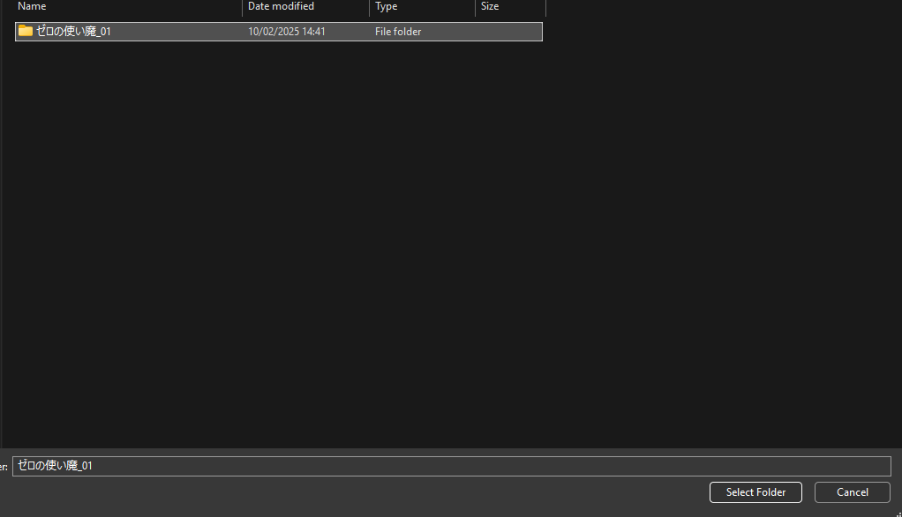
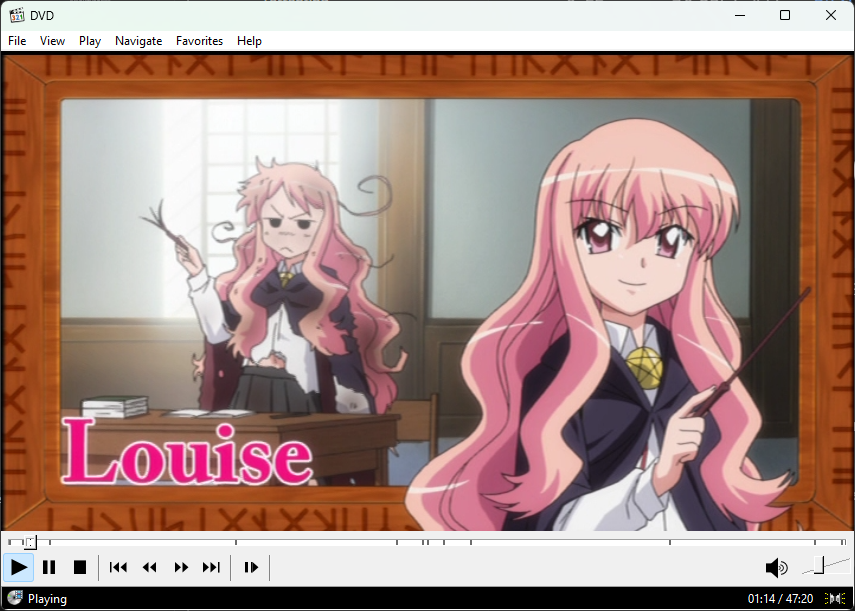
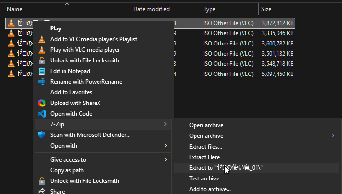
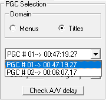
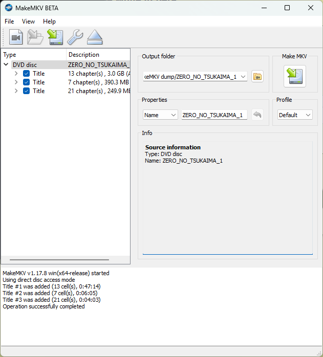
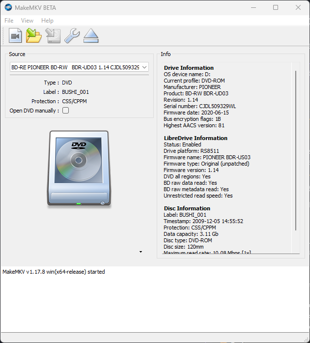
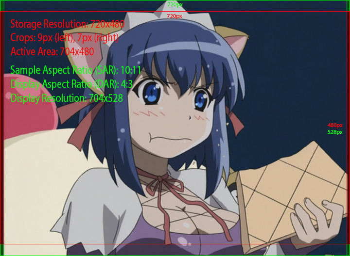
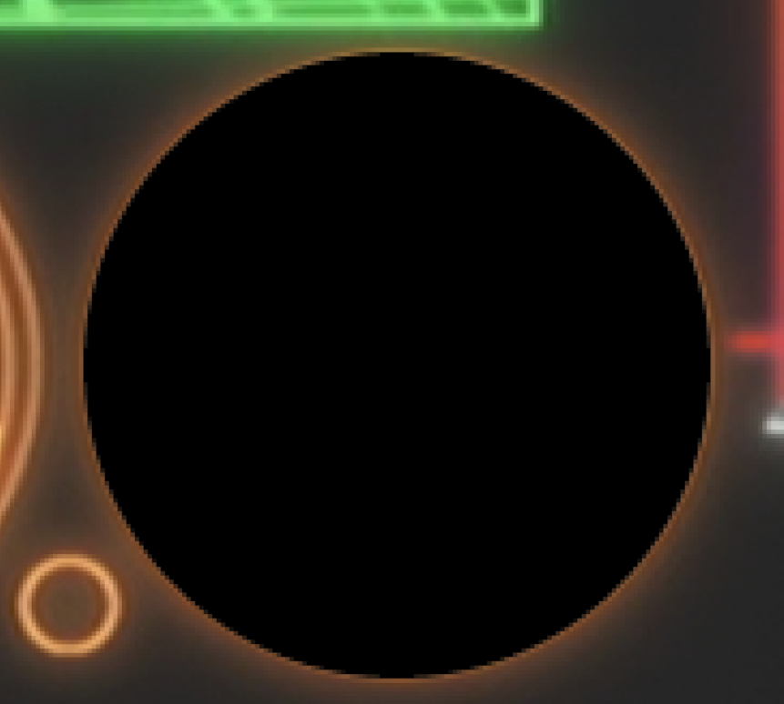

# Remuxing DVDs

When working on DVDs,
it helps a lot to have a clean mux
of each episode ready.
To do this,
you will need to remux the DVDISO,
and somehow split the remux into individual episodes.
This guide will cover different methods to accomplish this,
as well as cover some additional information
that's useful if you want to release a DVD remux.

## Understanding DVD Structure

There are multiple ways to remux a DVDISO.
However, it's also important
to understand _what_ you are remuxing.
DVDISOs are made up of the following:

- **Titles**: The main content units on a DVD. Each title typically contains one episode, movie, or bonus feature. These may also contain multiple episodes in one big title.
- **Angles**: Alternative video streams within a title, often used for different versions of the same content (such as theatrical and director's cut versions).
- **Chapters**: Markers within a title that allow skipping to specific points, like scene transitions or commercial break points.

Each of these elements can be important
depending on what you're trying to preserve.
For a basic episode remux,
you'll typically want to focus on the main title and chapters.
However, for a complete preservation,
you might want to capture all available angles as well.

??? question "What are PGCs?"

    PGCs (Program Chains) are part of the DVD video structure hierarchy.
    At the lowest level, multiple VOBUs (Video Object Units) form a cell.
    One or more cells make up a program,
    and one or more programs form a PGC.
    Programs can be identified as PTTs (Parts of Title),
    also commonly known as chapters.
    A title on a DVD consists of one or more PGCs,
    while a menu is made up of a single PGC[^pgc-references].

[^pgc-references]: For more information,
    see [the DVD-Video Program Chain structure information page](https://dvd.sourceforge.net/dvdinfo/pgc.html),
    [the DVD-Video Format Specification](http://www.mpucoder.com/DVD/),
    and [the Inside DVD-Video Wikibook](https://en.wikibooks.org/wiki/Inside_DVD-Video/MPEG_Format#VOBU,_Cell,_Program,_PGC).

## Analyzing Your DVD's Content

You will ideally want all of the above,
and the most straight-forward way to find them
is by using [MPC-HC](https://github.com/clsid2/mpc-hc)
(note that VLC and mpv
do not support all the functionality
covered in this guide
as of the time of writing).

??? question "What _do_ VLC and mpv support?"

    On Linux,
    mpv has okay-ish libdvdnav support,
    meaning you can use scripts
    such as [mpv-dvd-browser](https://github.com/CogentRedTester/mpv-dvd-browser)
    to navigate to different titles.
    Angles are still only accessible via the command line,
    and menus are unsupported.
    VLC also supports most functionalities,
    but has no support for different angles.

    If you don't need angle/menu support,
    and _really_ don't want to use MPC-HC,
    either of the above options
    may work for you.
    Nonetheless,
    this guide
    will only cover MPC-HC usage.

### Video

!!! example "How to view your DVD"

    === "ISO"

        1. Mount your DVDISO
        2. Open MPC-HC
        3. Hover over the _Files > Open Disc_ button
        4. Select your DVDISO

        

    === "Physical DVD"

        1. Insert your DVD into your DVD drive
        2. Open MPC-HC
        3. Hover over the _Files > Open Disc_ button
        4. Select your DVD drive

        

    === "Unpacked DVD"

        1. Open MPC-HC
        2. Hover over the _Files > Open DVD/BD button_
        3. Navigate to the directory containing your unpacked DVDISO
        4. Click on the folder the DVD was unpacked into
        5. Click "Select folder"

        

You should now be able to see the DVD content.

!!! info "Skipping to the menu"

    You can click _Navigate > Title Menu_ to skip the trailers/warning
    and get straight to the menu.



You will want to take note of
whether there are individual titles
for each episode,
or if they're all in one big title.
You can check this by clicking on the titles
under _Navigate > Titles_.
If they're all in one big title,
you will need to figure out how to split them.
You can find the split points by referencing the chapters.
These can be found on the timeline,
or by using the _Navigate > Chapters_ menu.

DVDs can contain multiple angles
for certain scenes,
though this is rare for anime releases.
These angles can be found
under _Navigate > Angles_.
If you want to preserve multiple angles,
you will need to remux each angle separately.
However,
for most anime DVDs,
you can ignore angles entirely
as they typically only contain
one viewpoint.

### Audio

You will also want to take note of the audio tracks.
DVDs can contain multiple audio tracks in different formats:

- PCM (uncompressed)
- AC3 (Dolby Digital)

The remuxing methods mentioned further below
will allow you to split these audio tracks
alongside the video.
However, special care needs to be taken with PCM tracks
for certain methods,
such as FFmpeg remuxing.

??? question "Why do PCM tracks need special handling?"

    DVD PCM audio uses big-endian byte order,
    while most computer audio uses little-endian.
    FFmpeg does not automatically handle this conversion,
    so PCM tracks need to be manually converted
    during the remuxing process.

    Since PCM is already uncompressed,
    it's recommended to convert it to FLAC
    to maintain the quality
    while ensuring proper byte order.
    Alternatively, you can convert to a lossy format
    like AAC or Opus if file size is a concern.

<!-- TODO: Fact-check the above once my MPC-HC wants to play nice -->
You can check which audio tracks are available
and their formats in MPC-HC
under _Navigate > Audio Menu_
and pressing `Ctrl + 3`,
by using FFprobe,
or by using [MediaInfo](https://mediaarea.net/en/MediaInfo/Download).

## Remuxing Methods

Below are multiple methods to remux your DVDISO.
If you are unsure if one method
produced the correct result,
try another method
and see if the result
is the same.

!!! example "Remuxing methods"

    === "FFmpeg"

        !!! warning "Version"

            This method requires BtbN nightly FFmpeg build!
            If you are using an older version,
            you will need to upgrade.
            You can find the latest BtbN nightly builds [here](https://github.com/BtbN/FFmpeg-Builds/releases/download/latest/ffmpeg-n7.1-latest-win64-gpl-7.1.zip).

        !!! info "Documentation"

            For more information on the command line arguments,
            see the [FFmpeg documentation](https://ffmpeg.org/ffmpeg-formats.html#dvdvideo).

        FFmpeg can be used to help split a DVDISO by Title, Angle, or Chapters.

        To remux the DVDISO,
        you will need to use the following command
        based on your needs:

        !!! example "Demuxing with FFmpeg"

            === "Title with chapters"

                ```bash
                ffmpeg -f dvdvideo -preindex True -title <title> -i "<input_file>" -map 0 -c copy "<output_file>"
                ```

                Replace the following keys:

                - `<input_file>`: The path to your DVDISO
                - `<title>`: The number of the title you want to remux (integer between 1 and 99)
                - `<output_file>`: The path to the output file

            === "Title with multiple episodes"

                ```bash
                ffmpeg -f dvdvideo -preindex True -title <title> -chapter_start <chapter_start> -chapter_end <chapter_end> -i "<input_file>" -map 0 -c copy "<output_file>"
                ```

                Replace the following keys:

                - `<input_file>`: The path to your DVDISO
                - `<title>`: The number of the title you want to remux (integer between 1 and 99)
                - `<chapter_start>`: The number of the chapter to start at (inclusive)
                - `<chapter_end>`: The number of the chapter to end at (inclusive)
                - `<output_file>`: The path to the output file

            === "Title with a different angle"

                ```bash
                ffmpeg -f dvdvideo -preindex True -title <title> -angle <angle> -i "<input_file>" -map 0 -c copy "<output_file>"
                ```

                Replace the following keys:

                - `<input_file>`: The path to your DVDISO
                - `<title>`: The number of the title you want to remux (integer between 1 and 99)
                - `<angle>`: The number of the angle you want to remux (integer between 1 and 9)
                - `<output_file>`: The path to the output file

            === "Menus"

                ```bash
                ffmpeg -f dvdvideo -menu True -pgc <pgc> -i "<input_file>" -map 0 -c copy "<output_file>"
                ```

                Replace the following keys:

                - `<input_file>`: The path to your DVDISO
                - `<pgc>`: The number of the PGC you want to remux (integer between 1 and 99)
                - `<output_file>`: The path to the output file

            !!! warning "PCM audio"

                If your DVDISO has PCM audio,
                you **must** to convert it to FLAC,
                as FFmpeg does not
                automatically handle this conversion.
                You can do that
                by adding the following parameter
                after `-c copy`:

                ```bash
                -c:a flac -compression_level:a 8
                ```

                If you have any tracks that are not PCM,
                you can prevent them from being converted
                by replacing `-c:a` with `-codec:<stream_id>`,
                where `<stream_id>` is the ID of the track
                you want to convert.
                You will need to add one of these
                for each track
                you want to convert.

    === "PgcDemux"

        !!! warning "Binaries"

            The GUI for PgcDemux is only available as a Windows binary.
            If you are on Arch Linux,
            the AUR has a `cpgcdemux` package
            for CLI functionality.
            PgcDemux reportedly works with Wine,
            but no guarantees are made
            that it will work
            as expected.

        PgcDemux is a tool
        that allows you to demux a DVDISO
        into individual titles and menus,
        as well as select angles.

        The download link can be found here:

        - [Jsoto's Vob/Ifo tools](https://download.videohelp.com/jsoto/dvdtools.htm)

        In order to use this program,
        you will need to have an unpacked DVDISO.
        Some downloads will come unpacked,
        but if you have a compressed ISO,
        you will need to unpack it first.
        This can be done with either WinRAR or 7-Zip.

        

        Once you have an unpacked DVDISO,
        you can open PgcDemux
        and drag the `VTS_XX_0.IFO` file,
        where "XX" can be any two digits,
        into the "Input IFO" box.
        Make sure to also set an output directory.

        Do take note of the path name!
        PgcDemux does not work
        if there are unicode characters
        in the path,
        such as Japanese characters.

        

        Once you have dragged the file into the program,
        you will see a window like the following:

        

        There are three modes
        to choose from.
        For our purposes,
        we will be using the "By PGC" mode.

        You can select different PGCs in the "PGC Selection" box.
        Under the dropdown menu, you can find invididual titles:

        

        In most cases, these will be split into individual episodes.
        If that's not the case,
        like here,
        you may need to split them manually later.

        Once you have selected the PGC,
        look at the box to the left.
        You will see a list of demuxing options.
        Set these to the following:

        

        Once you have set the options,
        you can click the "Process!" button
        to begin the demuxing process.
        This will output the files into your output directory.

        

        If the episodes are not split into individual files,
        you will need to split them manually.
        This can be done by remuxing the DVDISO
        using [mkvtoolnix](https://mkvtoolnix.download/)
        and splitting by time under the "Output" tab.

        

    === "MakeMKV"

        !!! danger "MakeMKV"

            MakeMKV is perhaps the easiest method
            to remux a DVDISO,
            but it's been known
            to create broken remuxes from time to time.
            Use this method
            at your own risk!

        !!! warning "Input file"

            MakeMKV requires a DVDISO
            or physical disc
            to work.
            If you only have an unpacked DVDISO,
            you will need to use a different method.

        MakeMKV can be downloaded from the following link:

        - [MakeMKV](https://www.makemkv.com/)

        Once you have downloaded and installed MakeMKV,
        you will need to register it.
        A free key can be found [here](https://forum.makemkv.com/forum/viewtopic.php?t=1053).
        Once you have registered it,
        you will need to restart the program.

        !!! example "Selecting titles"

            === "ISO"

                Click the "Open File" button
                and select your DVDISO.
                It will start processing the file,
                and then show you this window:

                

                Select the titles you want to remux,
                give it an output folder and name,
                and click the button underneath "Make MKV".

                

                Once it's done,
                the files will be in the output folder.

                

            === "Physical disc"

                Insert your physical disc.
                MakeMKV will automatically detect it,
                and then show you this window:

                

                Click the "Backup" button,
                select "Decrypt video files"
                (if possible),
                pick an output directory,
                and press "OK".
                It will now start creating
                a back-up of your disc.

                

                Once it's done,
                [follow the instructions
                for the ISO method](#__tabbed_5_1).

??? example "Multiple Angles"

    As mentioned above,
    DVDs can contain multiple angles
    for certain scenes,
    though this is rare for anime releases.
    Should your DVD contain multiple angles,
    you may want to preserve them.
    There are two ways to do this:

    === "Split into multiple files"

        !!! warning "Supported methods"

            This method is supported
            by the FFmpeg and PgcDemux methods.
            MakeMKV does _not_ support this feature!

        This is the most straightforward method,
        but will result in a larger release.

        To remux each angle separately,
        refer to the individual method's
        instructions on extracting specific angles.

    === "Editions"

        !!! warning "Player support"

            This feature is not supported
            by all players,
            so the safer option
            is to remux each angle separately.

        It's possible to keep all angles
        in one container
        by making use of [editions](https://www.matroska.org/technical/chapters.html#EditionEntry).
        This allows viewers to switch between angles
        by selecting the desired edition
        in their player.

        !!! warning "This table is incomplete!"

            This table is a stub
            and still very incomplete!
            You can help us
            by [expanding it](https://github.com/Jaded-Encoding-Thaumaturgy/JET-guide?tab=readme-ov-file#contributing).

## Setting the correct aspect ratio

DVDs (and later SD Blu-rays)
are stored in a format known as "anamorphic video".
This means that the stored video dimensions
differ from the intended display dimensions.
A typical NTSC DVD stores video at 720×480 pixels
(a 3:2 aspect ratio),
but displays it at either widescreen (16:9)
or standard definition (4:3) aspect ratios.

To achieve the correct display size,
DVDs make use of a [Sample Aspect Ratio (SAR)](https://en.wikipedia.org/wiki/Sample_aspect_ratio),
also known as a [Pixel Aspect Ratio (PAR)](https://en.wikipedia.org/wiki/Pixel_aspect_ratio).
This value tells the player how much to stretch each pixel.
The system was designed for CRT televisions,
which had [overscan](https://en.wikipedia.org/wiki/Overscan),
meaning they would stretch and slightly crop
the edges of the image,
which allowed the image to reach its intended [Display Aspect Ratio (DAR)](https://en.wikipedia.org/wiki/Display_aspect_ratio).

??? info "Understanding Aspect Ratio Math"

    To properly handle DVD aspect ratios,
    we need to understand three key components:

    1. **Display Aspect Ratio (DAR)**:
        The final width-to-height ratio
        of the displayed picture.

        - Widescreen content:
          DAR = 16:9 (~1.778:1)
        - Fullscreen content:
          DAR = 4:3 (~1.333:1)

    2. The **active area** of the frame.
        - This represents
          the actual visible picture area
          for which the DAR is defined,
          intended for display
          on traditional CRT TVs.
          This area may exclude
          some valid picture data
          due to production inconsistencies.
          The active area dimensions
          are _not_ explicitly stored
          as metadata,
          and must be [derived through heuristics](#heuristics).

    3. **Sample Aspect Ratio (SAR)**:
        The ratio that defines
        how rectangular each sample
        (aka pixel)
        should be
        when displayed.

        - Widescreen (DAR = 16:9):
          Each sample is displayed wider
          than it is high
          (e.g., by stretching horizontally
          or condensing vertically)
        - Fullscreen (DAR = 4:3):
          Each sample is displayed higher
          than it is wide
          (e.g., by stretching vertically
          or condensing horizontally)

    TODO: Let arch write the rest

During the DVD era,
content was typically confined
to a smaller [active area](https://en.wikipedia.org/wiki/Overscan#Overscan_amounts)
within the full frame.
When played on CRT televisions,
the combination of overscan and stretching
would display this active area
at the intended aspect ratio
while cropping the frame edges.
Modern displays
lack these characteristics,
so DVDs will display incorrectly
unless you account for the active area
and apply appropriate corrections
during the remux process.

Due to the above,
any DVD remux
that does not properly account for SAR/DAR
should be considered **_broken_**.

### Heuristics and reference table

SAR values have evolved
through multiple standards over time,
making it challenging to identify
the exact standard used for any given disc.
To help narrow down the correct values,
a reference table of common SAR values
and their corresponding active areas
is provided below[^sar-source]:

[^sar-source]: A number of SAR values were derived from
    [A Quick Guide to Digital Video Resolution and Aspect Ratio Conversions](https://web.archive.org/web/20140218044518/http://lipas.uwasa.fi/~f76998/video/conversion/#conversion_table).

!!! info "Common DVD anamorphic resolution standards"

    !!! warning "Other standards"

        While other standards exist,
        they are extremely uncommon.
        If your DVD's aspect ratio values
        don't match any listed here,
        there's a high probability
        that something is incorrect
        in your analysis.

    === "NTSC"

        | Display Aspect Ratio | Sample Aspect Ratio/Pixel Aspect Ratio | Active Area | Display Resolution |
        |----------------------|----------------------------------------|-------------|--------------------|
        | 4:3                  | 4320:4739                              | 710.85×486  |                    |
        |                      | 640:711                                | 711×480     | 711×533            |
        |                      | 160:177                                | 708×480     |                    |
        |                      | 10:11                                  | 704×480     | 704×528            |
        | 16:9                 | 2560:2133                              | 711×480     | 853×480            |
        |                      | 640:531                                | 708×480     |                    |
        |                      | 40:33                                  | 704×480     |                    |

    === "PAL"

        | Display Aspect Ratio | Sample Aspect Ratio/Pixel Aspect Ratio | Active Area | Display Resolution |
        |----------------------|----------------------------------------|-------------|--------------------|
        | 4:3                  | 128:117                                | 702×576     |                    |
        |                      | 1132:1035                              | 690×566     |                    |

!!! warning "NTSC to PAL conversions"

    When working with DVDs that have been converted between NTSC and PAL formats,
    the standard aspect ratio values may not apply.

    For these cases:

    1. First determine and correct the SAR values of the original format
    2. Analyze how the conversion process transformed the video
    3. Adjust your settings to match the original content's intended display

<!-- TODO: Maybe mention dvdunauthor? I only see Linux builds for this, but it may be useful for troubleshooting? -->

### Determining accurate SAR values

!!! warning "Square pixels"

    These methods will only work
    if you are using a frame server
    or are otherwise viewing
    the direct output
    of a DVD decoder.
    This is because the frames
    will be displayed
    as its storage
    as square pixels
    (720×480, SAR 1:1).

    All the frames
    given as examples
    are shown as square pixels,
    and the end result
    should look like
    the video would be displayed
    on a CRT monitor.

The following methods can be used
to help determine the correct SAR values.
Ideally,
you should cross-reference the results
of as many of these methods
as possible
to derive the most accurate SAR values.

!!! example "SAR heuristic methods"

    === "Faded columns"

        !!! warning "NTSC Active Area Standards"

            NTSC has two common active area standards
            that are very similar:

            - 710.85×486 (typically from analog transfers)
            - 704×480 (more common in digital sources)

            While the faded columns method below
            can help identify the active area,
            additional analysis may be needed
            to definitively determine
            which standard is being used.

        One way to determine
        the active area
        is by looking for faded columns
        on the edges of the frame.
        These faded borders
        are intentionally added
        to mark the boundaries
        of the active picture area.

        

        To calculate the active area width:

        1. Identify the fade width on the left and right sides (ignoring the top and bottom)
        2. Subtract both fades from the total frame width

        For example, if you have:

        - Total frame width: 720 pixels
        - Left fade: 9 pixels
        - Right fade: 7 pixels

        The active area width would be:
        `720 - 9 - 7 = 704 pixels`

        Once you know the active area
        and display aspect ratio (DAR),
        you can determine the correct SAR
        using the reference table above.

        In this example frame:

        - Active area: 704×480 (crop 9px left, 7px right)
        - DAR: 4:3
        - Therefore SAR: 10:11
        - Final display resolution: 704×528

        

    === "Circle method"

        Another method to determine the correct SAR
        is by finding objects in the frame
        that should be perfectly circular,
        like clocks, wheels, or logos.

        The process is straightforward:

        1. Find a frame with an object that should be a perfect circle
        2. In an image editor, overlay a perfect circle on top of the object
        3. Test different standard SAR values until the object matches the overlay

        

        The image above demonstrates a perfect match
        using a SAR of 2560:2133,
        which corresponds to a 711×480 active area.
        When the overlay aligns perfectly with the object,
        you've found the correct SAR.

    === "Logo method"

        Another approach is to compare text
        or studio logos
        against reference images.
        Many studio logos can be found online
        in their original square pixel form,
        which makes them useful reference points.

        The process is similar to the circle method,
        but uses a studio logo or text
        as the reference
        instead of a circle.
        You overlay the reference logo
        on top of the frame
        and adjust the SAR
        until they match perfectly.

        

        In this example,
        matching the logo
        gave us a SAR of 4320:4739
        (equivalent to a 710.85×486 active area).
        This level of precision
        would be difficult to achieve
        using just the faded column method.

    === "Ground Truth"

        !!! warning "Upscales are not valid references"

            Note that SD upscales do not qualify
            as valid reference sources,
            as they are not native square pixel sources.
            They had to go through the same process
            as you are doing now,
            and it's very likely
            that they were handled incorrectly!

        If you have access to a natively square pixel source
        (such as a Blu-ray release),
        you can use it as a reference
        to determine the correct SAR.

        This method is particularly useful
        for episodes that were only released on DVD
        when Blu-rays exist for other episodes,
        such as DVD-only OVAs.

        The process works as follows:

        4. Downscale the Blu-ray to 864×486
        5. Crop the image to 864×480 (matching the DVD master's crop)
        6. Test different SAR standards
           until the DVD matches the Blu-ray perfectly

??? question "I have black bars at the top/bottom! Do I need to change the height?"

    The SAR's standard active area height
    should be the height
    taken into account
    for this calculation.

    <!-- TODO: Further explain what to do here. -->

These checks can all be performed
using the following Vapoursynth code snippet:

```py
from vstools import Sar, mod4
from vskernels import Bicubic

sar = Sar.from_ar(
    <dar_num>, <dar_den>, <active_width>, <active_height>
)

if sar > 1:
    width, height = mod4(clip.width * float(sar)), mod4(clip.height)
else:
    width, height = mod4(clip.width), mod4(clip.height / float(sar))

clip_resized = Bicubic.scale(
    clip, width, height, keep_ar=True, sar=sar
)
```

??? question "Why use Vapoursynth?"

    Image editors are not capable of
    properly ensuring the active area
    gets stretched and cropped correctly,
    so we need to use a tool
    that can do this.

    The `vskernels` `Kernel` classes
    are all capable of
    handling the scaling
    and cropping correctly,
    including proper subpixel cropping
    and SAR adjustments
    that are essential
    for anamorphic content.

Replace the following keys:

- `<dar_num>` with the DVD's DAR numerator
- `<dar_den>` with the DVD's DAR denominator
- `<active_width>` with the SAR's standard active area width
- `<active_height>` with the SAR's standard active area height

Once you've determined the correct SAR values,
you can print out the new display dimensions
by printing the following values
at the end of the script:

```py
new_sar = sar * clip.width / clip.height
print(f"New display width: {new_sar.numerator}\nNew display height: {new_sar.denominator}")
```

??? info "Understanding SAR calculations and display dimensions"

    The formula multiplies the SAR
    by the stored frame's width/height ratio
    to calculate the intended display ratio.

    For example,
    using a 720×480 NTSC DVD
    with a SAR of 2560:2133:

    ```py
    Fraction(2560, 2133) * Fraction(720, 480) = Fraction(1280, 711)
    ```

    This results in a fraction
    that equals roughly 1.8,
    which matches the 16:9 DAR.
    While this could also be expressed as 853×480,
    keeping it as a reduced integer fraction
    like 1280:711 is preferable,
    since players treat these values as a ratio
    rather than actual final dimensions.
    Using larger integers in the ratio
    helps avoid rounding errors
    that could occur with smaller numbers.

### Setting SAR metadata

!!! note "Encode metadata"

    When encoding anamorphic content like DVDs,
    proper handling of display metadata is necessary
    to preserve the correct aspect ratio.
    The following sections explain how to do this.
    However,
    these steps only apply
    if you want to keep the video
    in its anamorphic format.
    If you plan to resample the video
    to square pixels,
    you can skip ahead,
    as the aspect ratio should be corrected
    during the resampling process.

Once we've obtained
the correct SAR values,
we can apply them
to the video.
Assuming a Matroska output,
we can use the following command:

```bash
mkvpropedit <input_file> --edit track:v1 --set display-unit=3 --set display-width=<display_width> --set display-height=<display_height>
```

Replace the following keys:

- `<input_file>`: The path to your input file
- `<display_width>`: The new display width value
    obtained from the SAR calculation
- `<display_height>`: The height of the display
    obtained from the SAR calculation

### Setting cropping metadata

!!! warning "Supported players"

    Container-side cropping metadata
    is not widely supported!
    Most players will not respect this metadata
    and still show the faded columns.
    Support for this
    should improve
    with time,
    so you should still
    set this metadata.

    ??? info "Currently supported players"

        The following players support
        this metadata
        as of the time of writing:

        | Player        | Supports it? | Notes                                                               |
        | ------------- | ------------ | ------------------------------------------------------------------- |
        | mpv           | ✅           | Subtitle display may vary based on user settings                    |
        | FFmpeg        | ✅           | Interprets crop flags differently from mpv, following Matroska spec |
        | VLC           | ❌           |                                                                     |
        | MPC-HC        | ❌           |                                                                     |

        ??? question "mpv and `blend-subtitles`"

            As of the time of writing,
            when subtitles are blended
            onto the video
            differs depending on the `blend-subtitles` parameter.
            When `blend-subtitles=no`,
            the subtitles get rendered
            *after* cropping.
            With `blend-subtitles=yes`,
            the subtitles get rendered
            *before* cropping.
            This means that to render subtitles correctly,
            you must target `blend-subtitles=yes`
            when authoring
            (as this will ensure
            the subtitles are placed
            at the same location
            as in other players
            that do not support cropping).

Container-side cropping metadata defines
which parts of the video frame
should be cropped during playback.
Like the SAR metadata discussed earlier,
this information can be embedded
into Matroska files
using mkvpropedit:

```bash
mkvpropedit <input_file> --edit track:v1 --set pixel-crop-left=<left> --set pixel-crop-right=<right>
```

Replace the following keys:

- `<left>`: Number of pixels to crop from the left edge of the frame
- `<right>`: Number of pixels to crop from the right edge of the frame

If your disc contains black bars
at the top and/or bottom of the frame,
you should crop those as well
using the following command:

```bash
mkvpropedit <input_file> --edit track:v1 --set pixel-crop-top=<top> --set pixel-crop-bottom=<bottom>
```

Replace the following keys:

- `<top>`: Number of pixels to crop from the top edge of the frame
- `<bottom>`: Number of pixels to crop from the bottom edge of the frame

These cropping values can be combined with the SAR metadata settings
from the previous section into a single mkvpropedit command,
as shown in the example below.

```bash
mkvpropedit <input_file> --edit track:v1 --set display-unit=3 --set display-width=<display_width> --set display-height=<display_height> --set pixel-crop-left=<left> --set pixel-crop-right=<right> --set pixel-crop-top=<top> --set pixel-crop-bottom=<bottom>
```

<!-- TODO: Add more sources. Ideally actual documentation and papers from relevant authorities. -->

## Subtitles

!TODO: Write this section, better splits, get math checked (arch/chortos pls? <3)

When remuxing from a source
with 1:1 SAR subtitles,
you will need to adjust
the subtitle positions
to account for the new SAR.
For example,
if your source has subtitles
authored for 704x480 1:1 SAR,
but your video is 853x480 with 16:9 SAR,
you will need to scale
the subtitle positions horizontally
by a factor of 853/704.
This ensures the subtitles
appear in the correct location
relative to the video content.
