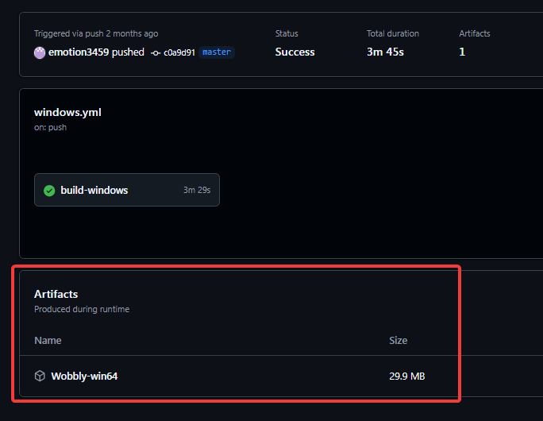
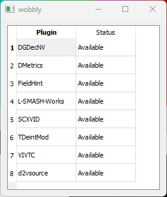

# Set-up

Wobbly is a tool used for manual inverse telecine (IVTC), the process of converting telecined content back to its original framerate.
It's a staple in any serious DVD encoder's toolkit, and gives you precise control over how to IVTC video.

## Limitations

Before installing and setting up Wobbly,
it's important to recognise its limitations.

### 5-frame cycle only

Wobbly exclusively processes 5-frame telecine cycles,
specifically the 3:2 pulldown pattern used in NTSC content.
This means it only works with video from NTSC regions
like Japan and North America[^1],
and cannot handle PAL/SECAM sources.
It cannot process variable telecine cycles
that may occur when editing telecined footage directly.
The software provides no support for detecting
or handling alternative pulldown patterns.

[^1]: See [this wikipedia page](https://en.wikipedia.org/wiki/DVD_region_code#PAL/SECAM_vs._NTSC) for more information.

### Field-Based content only

Wobbly explicitly only supports field-based video,
meaning the source must retain its original interlaced fields.
Any video that has been deinterlaced,
even if it follows a 3:2 pulldown pattern,
cannot be processed correctly by Wobbly.
This includes footage processed through:

- YADIF or other deinterlacing filters
- Field blending
- Field matching/combining
- Progressive scan conversion

!!! example "Telecined video that went through field blending"

    

    The OP for Fate/EXTELLA was deinterlaced using a field blending approach,
    which combines the fields into single progressive frames.
    While this preserves the 3:2 pulldown pattern,
    the loss of distinct fields makes proper IVTC impossible.
    This type of content cannot be processed with Wobbly[^2].

[^2]: While Wobbly is not designed to fix field blending issues directly,
    it can be used to identify and scenefilter sections of field-blended content
    through its [custom list functionality](../advanced-usage.md).

### "True" VFR

Wobbly does not support true variable framerates (VFR).
Since decimation is strictly based on the telecine cycle,
any VFR ranges get rounded to the nearest supported framerate.
This limitation stems from Wobbly only supporting
a fixed set of framerates:

- 5.994 (6) fps
- 11.988 (12) fps
- 17.982 (18) fps
- 23.976 (24) fps
- 29.97 (30) fps

Additionally, Wobbly lacks native support
for outputting 59.94 (60) fps video.

### Decimation breaks

During the early digital era,
video editing was commonly performed
on already telecined footage.
This often resulted in splices
that introduced extra frames,
disrupting the standard telecine pattern.

When encountering these disrupted patterns,
Wobbly will assign an incorrect framerate
rather than attempting to fix the cycle.
This differs from YATTA's behavior,
which would automatically detect such issues
and apply appropriate decimation.

While we cover manual fixes
in the "Fixing the Framerate" section,
this represents a regression
from YATTA's automated handling.
Future versions of Wobbly may address
this limitation.

### Interlaced content

As mentioned in the ["True" VFR section](#true-vfr),
Wobbly does not currently support 60p output.
This means that interlaced content requiring deinterlacing
cannot be processed directly through Wobbly.
However, you can work around this limitation by:

1. Marking interlaced scenes as 30p
   and setting "CCCCC" matches
2. Deinterlacing the video in your own filterchain
   after Wobbly processing
3. Manually regenerating timecodes
   to account for the doubled framerate

Alternatively,
if you want to use Wobbly's timecodes output functionality,
you'll need to pull down 60i content to 30p first.
This will make sure
the content matches
one of Wobbly's supported framerates.

## Installation

We recommend installing the [JET fork of Wobbly](https://github.com/Jaded-Encoding-Thaumaturgy/Wobbly/releases).
This fork contains various improvements and bugfixes over the original.

=== "Latest Stable"

      1. Download the latest `Wobbly-win64.zip` from the [releases page](https://github.com/Jaded-Encoding-Thaumaturgy/Wobbly/releases)
      2. Extract the ZIP file to a location of your choice
      3. The executable can be run directly without any additional setup

=== "Development"

    !!! warning "Artifact Expiry"

        GitHub Actions artifacts are only available
        for 90 days after creation.
        If you cannot download an artifact,
        it may have expired.
        In this case, use the latest stable release instead.

    If you need the latest features or fixes not yet in a stable release:

    1. Visit the [GitHub Actions page](https://github.com/Jaded-Encoding-Thaumaturgy/Wobbly/actions)
       (requires a GitHub account)
    2. Click on the most recent successful workflow run
    3. Download the "Wobbly-win64" artifact from the Artifacts section
    4. Extract and use like the stable release

    !!! example "Finding the Artifact"

        

### Dependencies

Wobbly requires several VapourSynth plugins to function properly:

Required plugins:

- [DMetrics](https://github.com/vapoursynth/dmetrics)
- [FieldHint](https://github.com/dubhater/vapoursynth-fieldhint)
- [SCXVID](https://github.com/dubhater/vapoursynth-scxvid)
- [TDeintMod](https://github.com/HomeOfVapourSynthEvolution/VapourSynth-TDeintMod)
- [vivtc](https://github.com/vapoursynth/vivtc)

Optional plugins (depending on input format):

- [bestsource](https://github.com/vapoursynth/bestsource) - General file support
- [L-SMASH-Works](https://github.com/AkarinVS/L-SMASH-Works) - General file support
- [d2vsource](https://github.com/dwbuiten/d2vsource) - D2V index file support
- [DGDecNV](https://www.rationalqm.us/dgdecnv/dgdecnv.html) - DGIndex/DGDecNV support

??? question "Verifying plugin installation"

    To check if Wobbly can find all required plugins:

    1. Open Wobbly
    2. Click _Tools > Check plugins_
    3. A window will appear showing the status of each plugin

    !!! example "Plugin status window"

        

Wobbly consists of two main components:

- Wibbly: The analysis component that examines the video and collects detailed metrics about:

  - Field patterns
  - Scene changes
  - Interlaced fades
  - Other relevant metrics

These metrics are stored in a JSON file for later processing.

- Wobbly: The processing component that:

  - Reads the JSON analysis file from Wibbly
  - Determines the optimal IVTC method for each section
  - Applies the appropriate IVTC operations
    and other custom filtering set by the user
  - Produces the final progressive output

## Setting up Wibbly

!!! warning "This section is incomplete!"
    This section is a stub.
    You can help us
    by [expanding it](https://github.com/Jaded-Encoding-Thaumaturgy/JET-guide?tab=readme-ov-file#contributing).

    ??? question "How can I help?"

        - Writing Wibbly preperation steps
        - Adding the python version (via vspreview?) instructions

Wibbly is used for metrics gathering and preparing a WOB file.
There are two implementations.

=== "Program"

    ...

=== "Python module"

    ...

## Setting up Wobbly

!!! warning "This section is incomplete!"
    This section is a stub.
    You can help us
    by [expanding it](https://github.com/Jaded-Encoding-Thaumaturgy/JET-guide?tab=readme-ov-file#contributing).

    ??? question "How can I help?"

        - Writing Wibbly preperation steps
        - Adding the python version (via vspreview?) instructions
